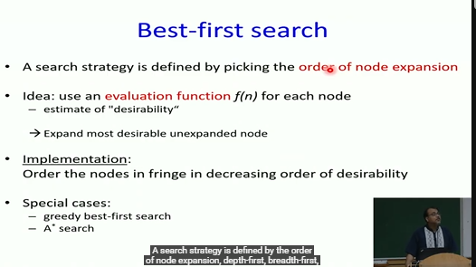
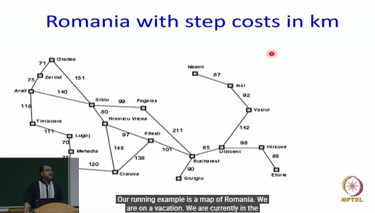
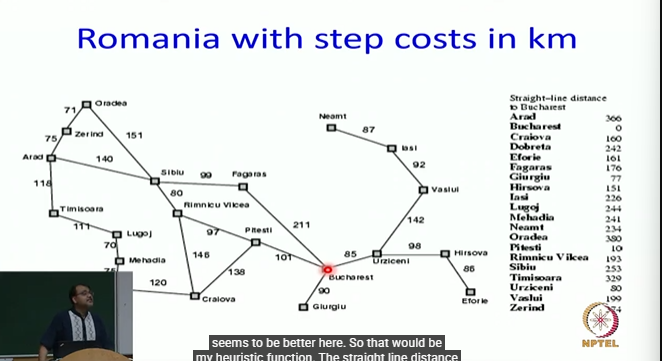
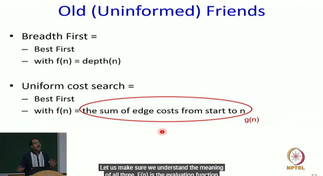

# Informed Search: Best First Search Part-1

> If you ask a lot of traditional people, people who have been working in the AI field for the last 50-60 years, they will say AI is search  
> Search is so important, so central to the field of AI, that you can almost say that AI is search.  
> If you can do search right, you can solve all AI problems, all problems of intelligence  
> I am not going to go as far as saying that  
> Algorithms that we considered DFS, BFS, iterative deepening, beam search and bidirectional search are good algorithms  
> but in the last part of the class we realized that they are not satisfying. They look in all directions  
> They are not guided towards the goal somehow  
> **We need to add guidance and we call it as informed search**. It is an important topic in the field of AI

# Informed Search: Best First Search Part-1
* Based on Slides by Stuart Russell, Richard Korf, Subbarao Kambhampati, and UW-AI faculty

> The main idea of informed search algorithm is that we need to add some intuition in our search algorithms. We don't want it to blindly looking in all directions hoping that by mistake it reaches the goal.  
> We would encourage it to go towards the goal and add intuition but of course  

"Intuition, like the rays of the sun, acts only  
in an inflexibly straight line; it can guess  
right only on condition of never diverting  
its gaze; the freaks of chance disturb it."  
-- Honore de Balzac

## Informed(Heuristic) Search
* Greek word: εὑρίσκειν (heuriskein) → meaning “to find” or “to discover”
    * Heuristic means a practical approach or rule-of-thumb used to solve a problem quickly, especially when a perfect or complete solution is not feasible.
    * Instead of guaranteeing the best answer, a heuristic helps you reach a good enough answer efficiently.
* Idea - be smart about what paths to try
    * e.g. I want to go that chair which is present there. Now I don't want to look backwards unless there is some invisible obstacle present as like in science fiction


### Blind Search vs. Informed Search
* What's the difference?
* How do we formally specify this?
    * **A node is selected for expansion based on an evaluation function that estimates cost to goal.**

> Here we are giving more inforamtion. but what information could we give? That's the question.
> I am simply making an observation that this node is probably closer to the goal. That is the intuition I have. For now, this node looks beter to me than this node because this node is seemingly closer to the goal. And that is the inutition we somehow want to capture
> And we will capture via heuristic function

### General Tree Search Paradigm

* Fringe = all the options you know about but haven’t explored yet.

```txt
function tree-search(root-node)
    fringe <-- successors(root-node)
    while ( notempty(fringe) )
        {node<--remove-first(fringe) //lowest f value
            state<--state(node)
            if goal-test(state) return solution(node)
            fringe<--insert-all(successors(node),fringe) }
    return failure
end tree-search
```

### General Graph Search Paradigm

```txt
function tree-search(root-node)
    fringe<--successors(root-node)
    explored<--empty
    while ( notempty(fringe) )
        {node<--remove-first(fringe)
            state<--state(node)
            if goal-test(state) return solution(node)
            explored<--insert(node,explored)
            fringe<--insert-all(successors(node),fringe),if node not in explored)
return failure
end tree-search
```

* When do I know I have found my goal?
    * When I remove the node from the fringe


## Best-First Search



> So that leads us to our generic best first search algorithm

* Use an evaluation function f(n) for node n.
* Always choose the node from fringe that has the lowest f value.

DFS - you use Stack  
BFS - You use Queue  

here we need a priority Queue data structure for **Best-First Search**

* **Romania with step costs in km**





above can be done by dijkstra's algorithm as well but here we want to solve with Best-first search

* The straight line would be mine heuristic function



> f(n) says which is the best node overall cumulatively  
> g(n) says which is the closer node from the start to end  
> h(n) says how far is the goal from me  


