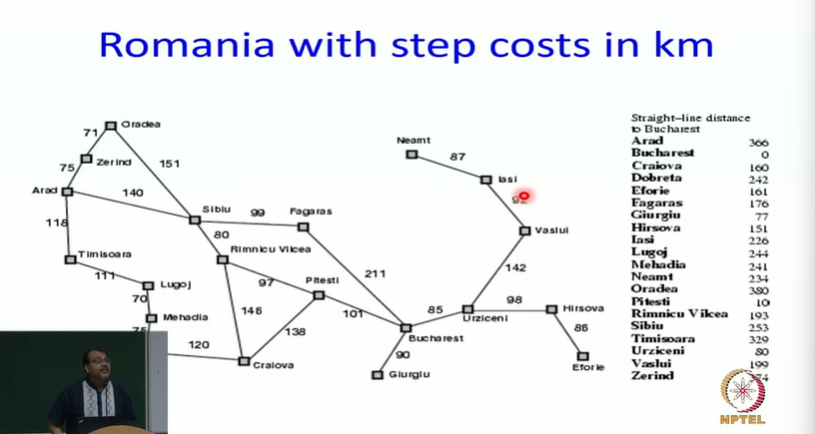
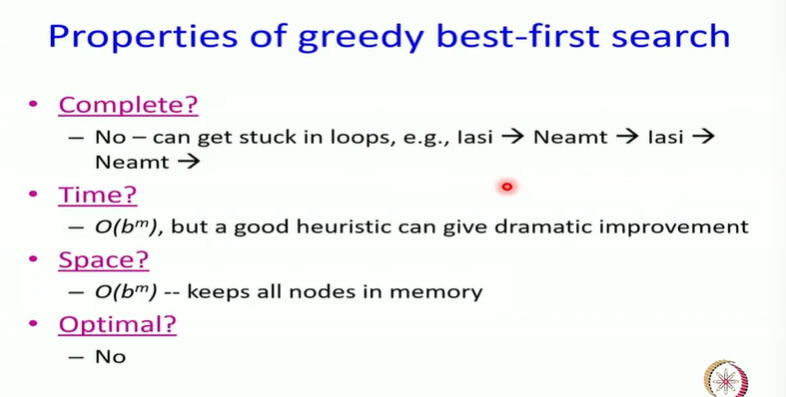
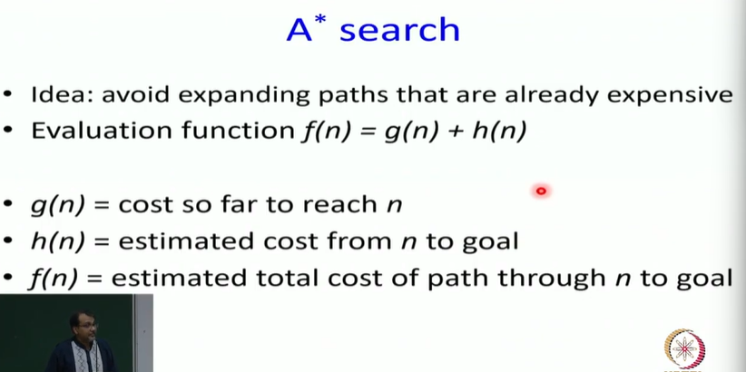

# Informed Search: Greedy Best First Search and A* Search Part-2

## Greedy best-first search

## Properties of greedy best-first search
* Complete?
* Time?
* Space?
* Optimal?

> It gets stuck in loop. we need to do something about it. what intuitively what is going wrong?

> So I am going to simplify g(n) and h(n) and this algorithm that comes out is called A* algorithm

## A* search

