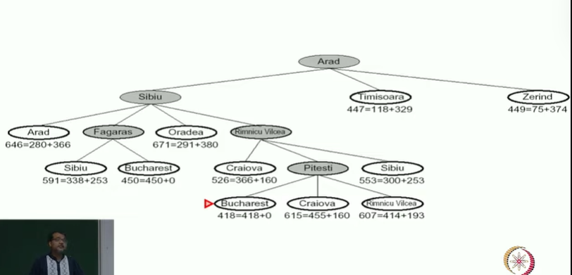
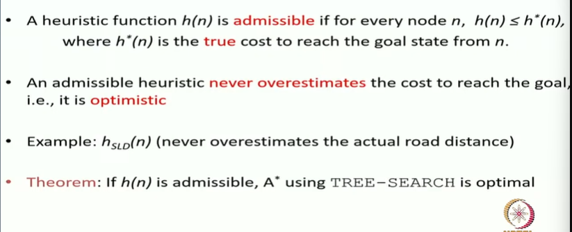
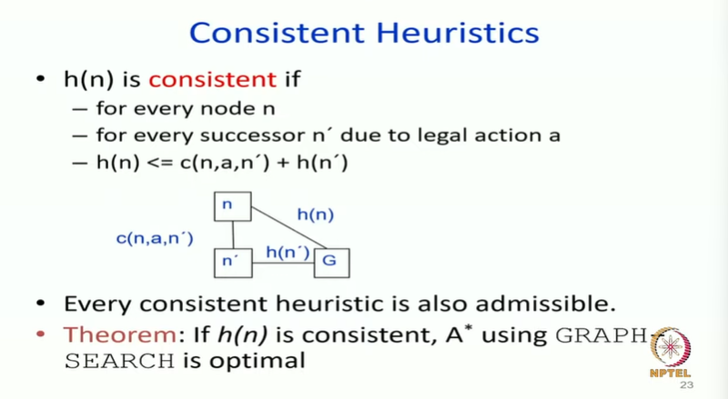
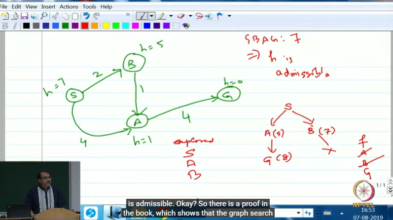
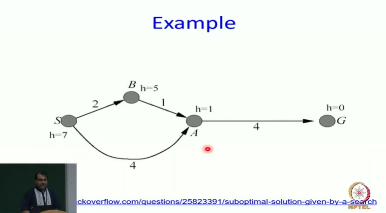

# Informed Search: Analysis of A* Algorithm Part-3

## A* for Romanian Shortest Path

## Admissible heuristics

## Consistent Heuristics

> So there is a proof in the book which shows that the graph search version of A* is optimal if you expand using consistent Heuristics.

