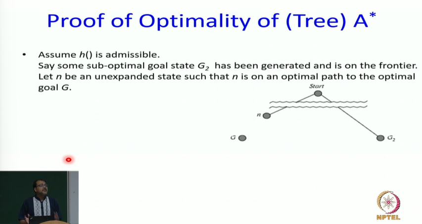
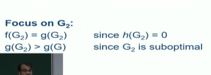
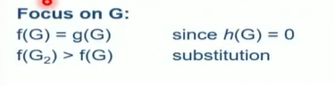
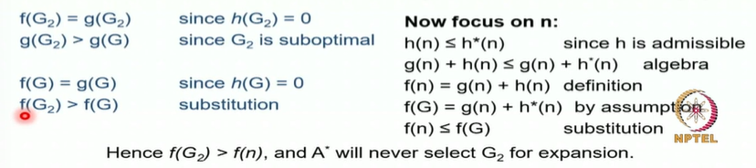
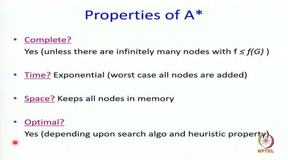

# Informed Search Proof of optimality of A* Part-4

> Let's do atleast one proof in this class
> Problem statement - If h() is admissible, then whenever A* removes goal from the fringe, we would have found the optimal path









```txt
This intuition of optimism is extremely important and it is going to to come up again and again in variety of places, nut necessarily in this course, but in all kinds of search algorithms.
The idea that you should be optimistic is a great idea. 
Later we will have uncertainty. We will have probabilistic models and th is a concept of called optimistic in the face of uncertainty. 
That if you can have you know a range of from negative to positive and you are maximizing, take the positive at its value and that is going to help you in getting to the optimal path.
So this intuition that admissibility optimism is awesome for search remains with you in a variety of search algorithms
```

> So I encourage you to think about this proof and read up for A* graph search  

## Properties of A*



> This is considered to be one of the most important search algorithms traditionally

The A* algorithm was developed as part of the shaky
project in Stanford and it had far reaching consequences
and in fact it is said that **driving directions** engine in bing travel, Google Maps, at least that I read a report about 1O years ago was using some notion of hierarchical version of A*, and A* has been used extensively in a wide
variety of algorithms and continues to be used. So it is one
of the algorithms from the 60s which is still as important
as anything else in AI.