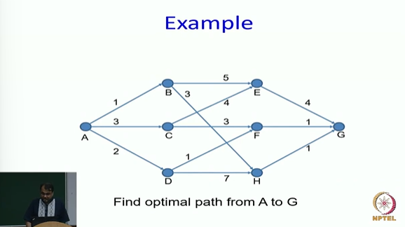
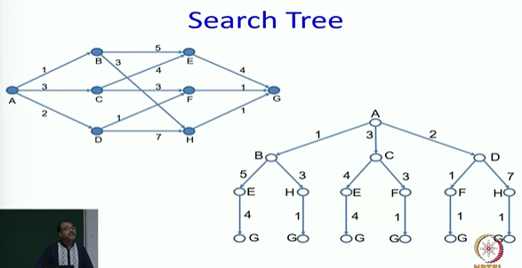
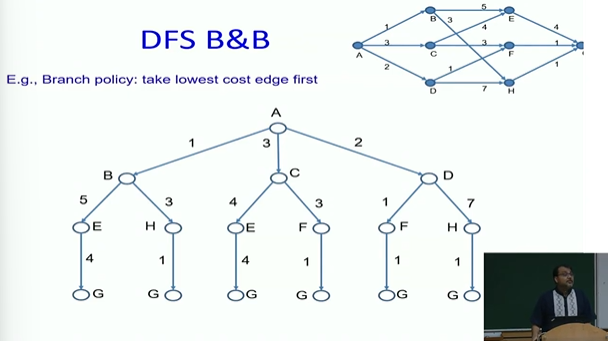
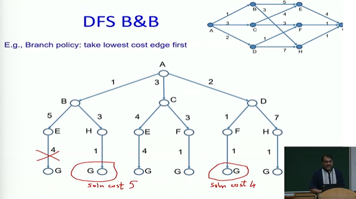
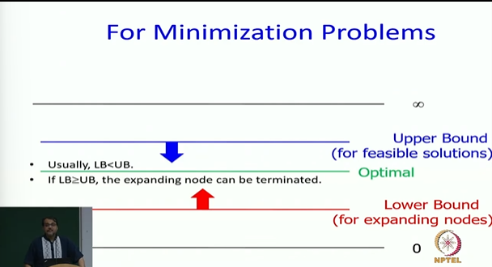
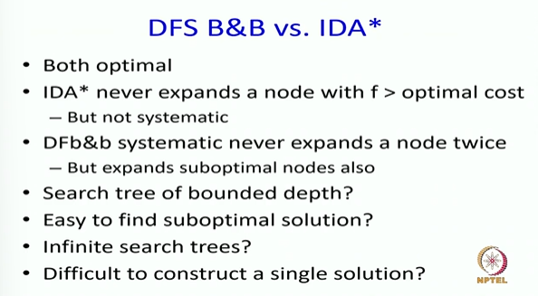
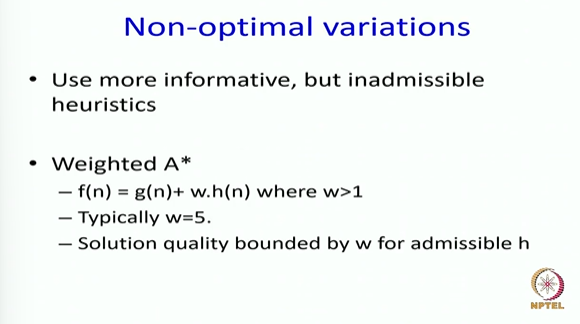

# Informed Search: Iterative Deepening A* and Depth First Branch & Bound Part-5

* For real problems we implement A* Algorithm

## Depth First Branch and Bound Algorithm

* If there is an infinite depth graph, which algorithm will be better? IDA* is better because it is possible I go into some ruthole and never come back
* When would DFS branch and bound will be better algorithm?
  * When I have a better estimate of an upper bound. it requires additional domain knowledge

> If it is easy to find a sub optimal solution, branch and bound might do better. If it is difficult to construct a single solution IDA* might do better

## Non-optimal variations

