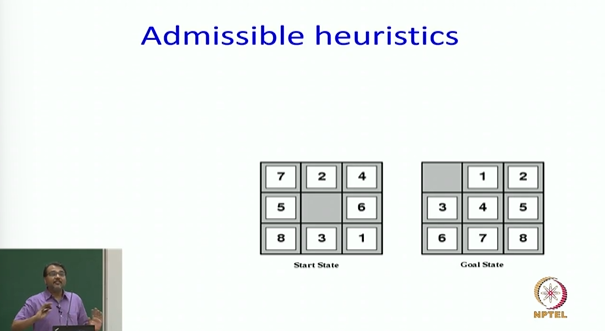
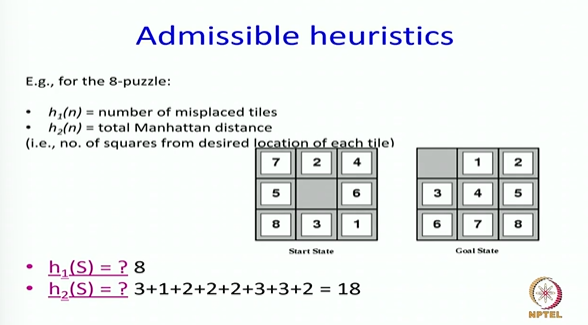
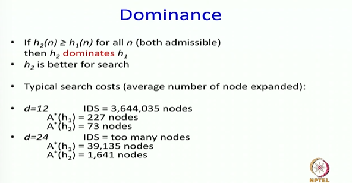
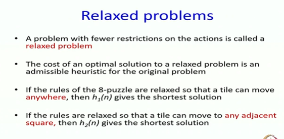
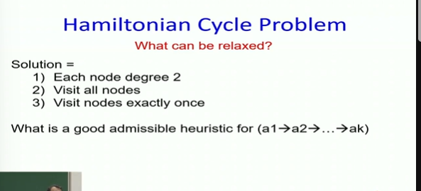
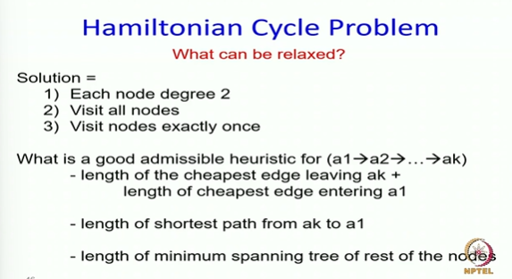

# Informed Search: Admissible Heuristics and Domain Relaxation Part-6

* How does the domain designer come up with a heuristic function?

* **Goal for today**
  * To think about how we come up with admissible heuristics given a new problem
  * is there some theory behind?
  * is there some mechanism?
  * is there some thought process that allows us to construct admissible heuristics?

* **What is an admissible heuristic?**
  * A heuristic which feels that goal is closer than what it looks like
  * Or I will make more money than I am actually going to make
  * IOW, If I am in a minimization problem, an admissible heuristic is always a lower bound and if I am in a maximization problem my admissible heuristic is always an upper bound.

## Relaxed Problems

## Hamiltonian Cycle Problem

