# Informed Search: Pattern Database Heuristics Part-7

> I would like to talk about this very important phenomena
> How expensive should my heuristic be?

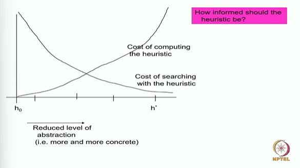

* Above is an intuitive graph not drawn from emperical data
* As I increase the informativeness of the heuristic, the cost to compute the heuristic increases
* On the other hand if I give you a good heuristic, your cost of searching is going to reduce

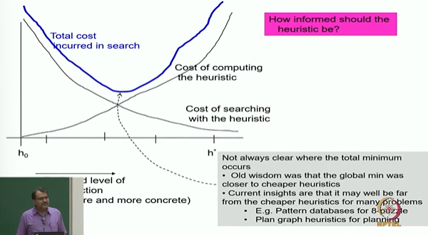

* In total cost will be above blue line because in total cost you also have to do heuristic computation plus you also have to do search

## Pattern database Heuristics

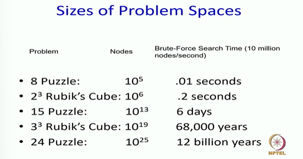

## Performance of IDA* on 15 Puzzle

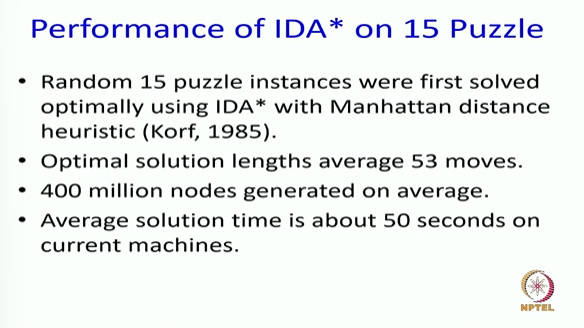

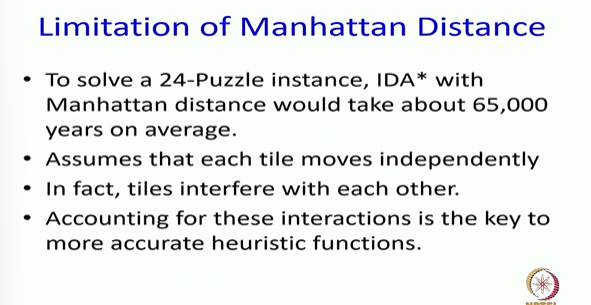

* The problem is that heuristic is good but not great. It is not modelling a lot of things

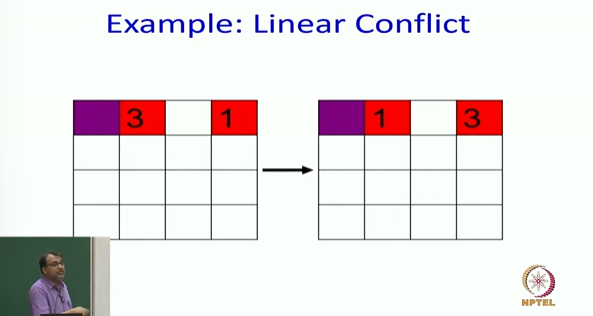

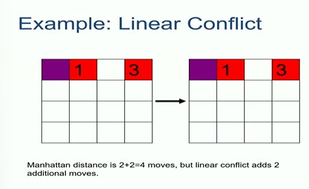

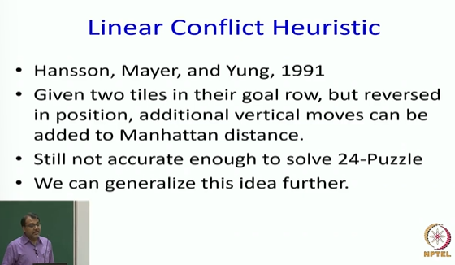

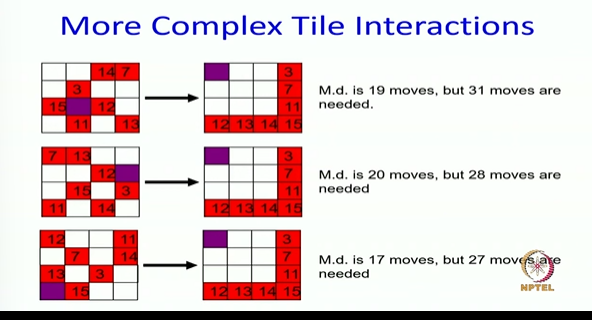

* Just solving this is going to be expensive, so we will do this expensive operation once.
* And all th heuristic values will put in a database. Here is where your database class comes in handy, and then you do an index on top of it so that your database is now quickly randomly accessible. And now when you actually do search, you ask the database for the heuristic value. You have cached all the heuristic values. This is called pattern database heuristic

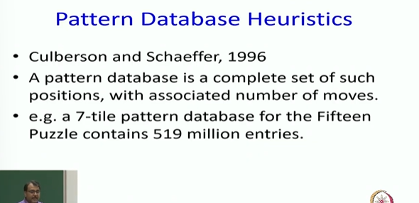

## Precomputing Pattern databases

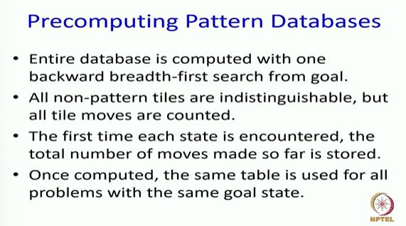

## Combining Multiple Databases

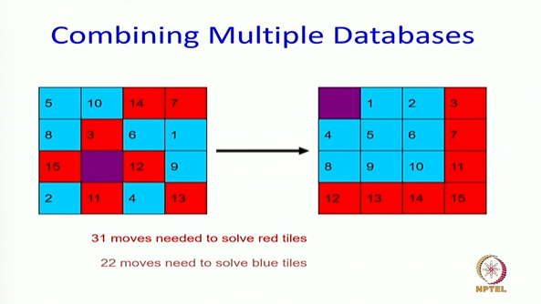

> Overall admissible heuristic is 31 moves

## Additive Pattern Databases

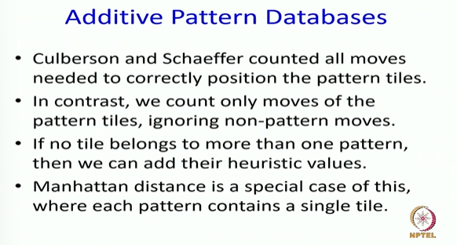

## Performance

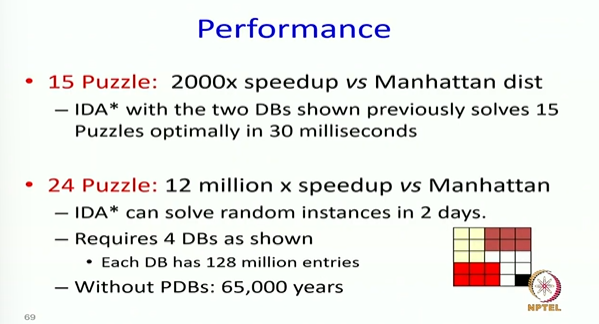

## Summary upto now

So let me summarize.
So we have been discussing this whole idea of search algorithms  
and we have now come to a nice landmark point where we have
studied a lot of search algorithms which are going from the start state and developing a tree and sort of maintaining part of the tree  
in my memory or visiting it and backtracking it and things like that.  
There is memory implications, there are time implications whether you maintain the frontier or you do depth first. We have also figured out how to use additional heuristic function, additional information to do things faster and we have done several examples to think about how.  
Quickly they can solve some problems if you have a good heuristic.  
We have discussed how to compute good heuristics. At least
admissible heuristics required domain relaxations and then these relaxations can sometimes become large. So sometimes you want to do them in a batch, compute all the sticks and then put them in a database. And sometimes state space is too large. You cannot do
this. So you break the state space into multiple sub parts, compute heuristics on top of them, put it in multiple databases and Max or add them. These are called pattern databases.  
So this is our story up to now.

> In next class, we will talk about local search, a very different but in some ways in my opinion more practical a different mechanism for doing search and solving problems  
