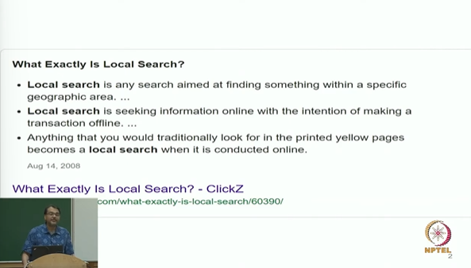
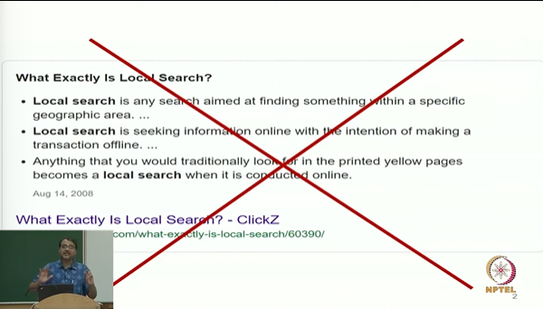
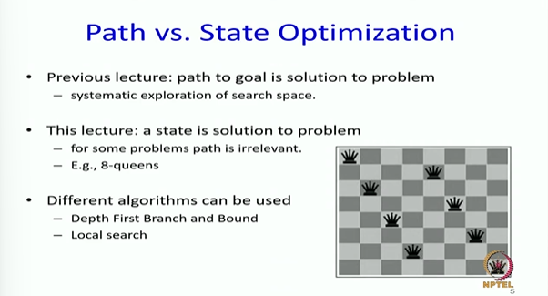
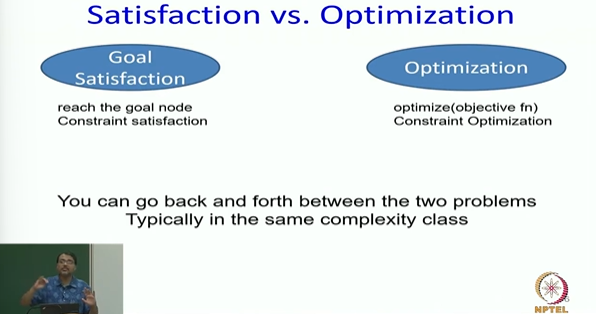
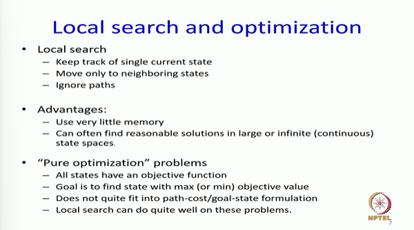

# Local Search: Satisfaction Vs Optimization Part-1

> Search is extremely important  
> It is a fundamental way to even think about solving a new problem  
> We have done many search algorithms. We have done at least 4 uninformed search algorithms and atleast 4 informed search algorithms  

## What exactly is local search?

* We are going to talk about general search algorithms where any problem can be formulated as a search problem adn then solve using one algorithm.  
* And one such algorithm is local search algorithm  
* Actually it's a family of algorithms and we will talk about what this family means in this lecture series  
* And we will end up talking about 20 algorithms  

* We are going to turn things around completely in local search and this is the fundamental difference
* We will now be in a setting where not the path, but the state itself is the solution  
* **Each search node would be a solution**. A good solution, a bad solution , but it will be a solution in the worst case. You can return it and get some credit for it.  

> For above placing Queens. All queens should be placed such tha tno 2 queens attacking each other.  
> But notice - we were trying to find the shortest path to a goal  
> We are only interested in that final state which satisfies all our constraints. Where should the queens be placed in that final state  

## Satisfaction vs Optimization  

* **Satisfaction Problem** - Here I am only interested in find me a path to the goal. And I am just interested in making sure that all my constraints are satisfied. It does not matter whether it is the most optimal way to satisfy them or not. 

> In this class we are not going to talk about of optimization problems where your variables are continuous  
> We are going to talk about where the variables are discrete not continuous  

## Local Search and optimization

