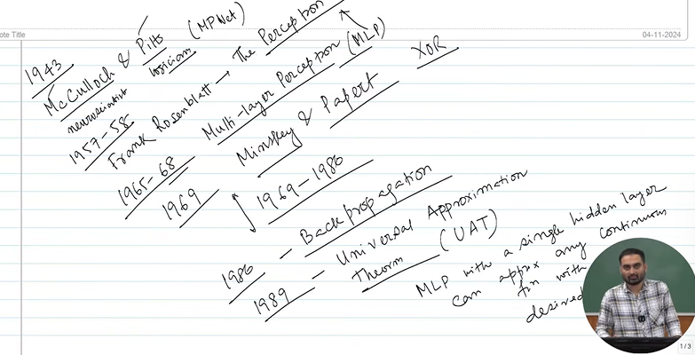
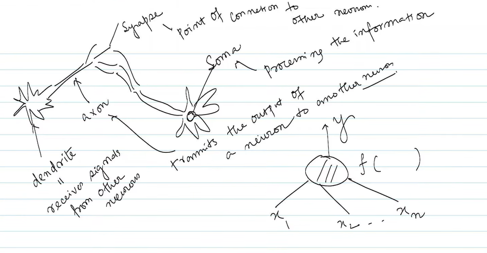
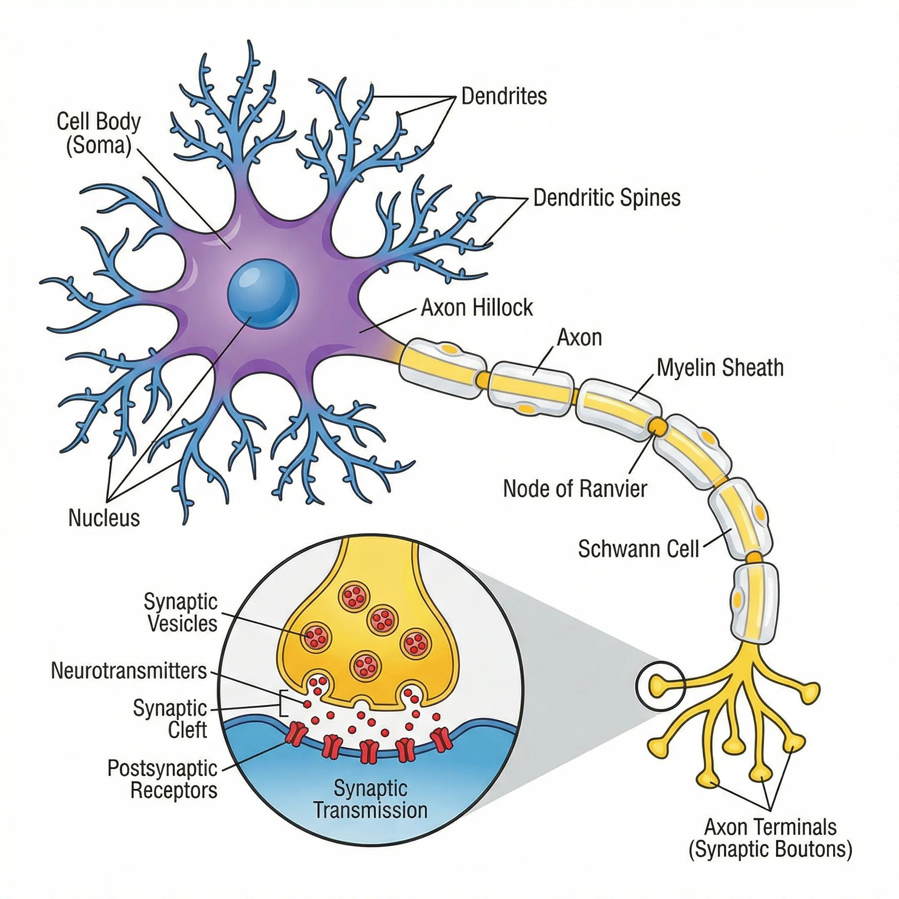
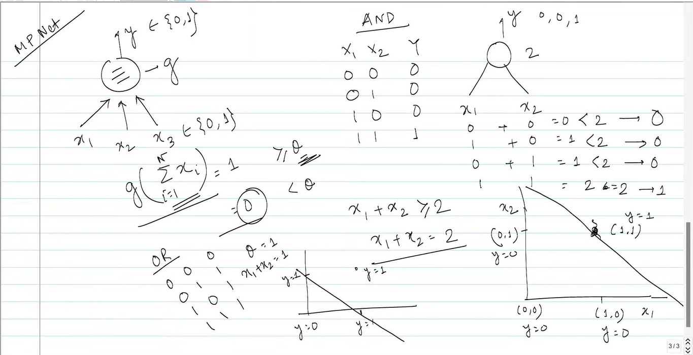
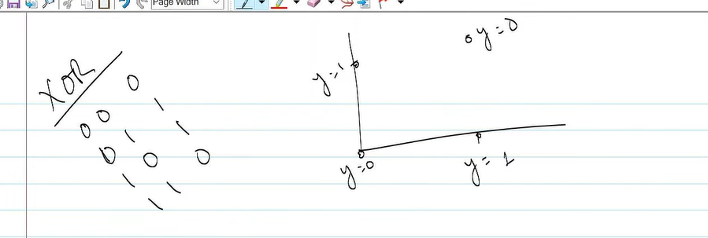
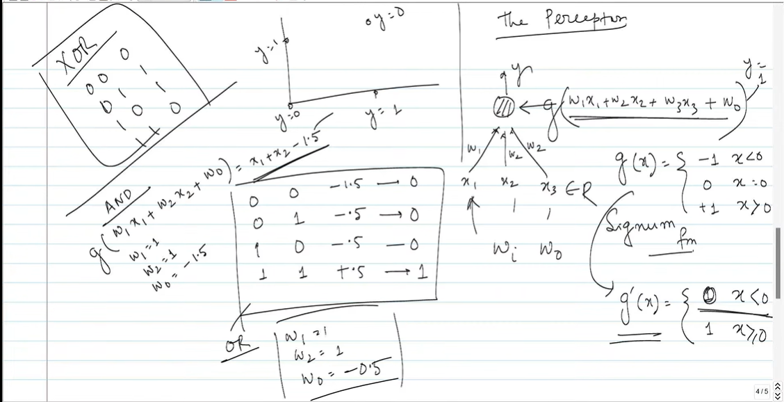
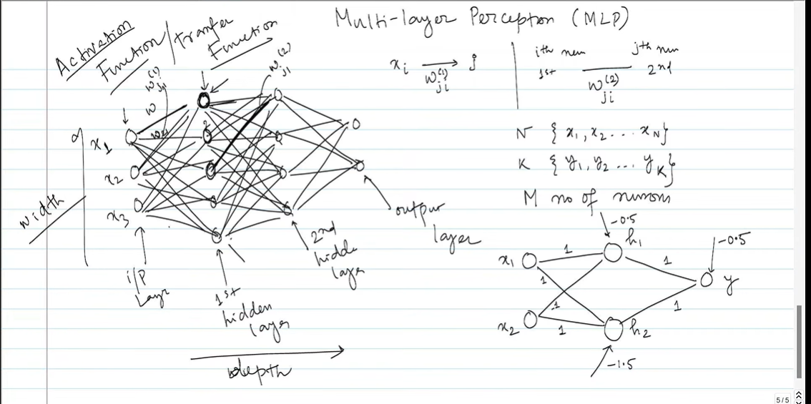
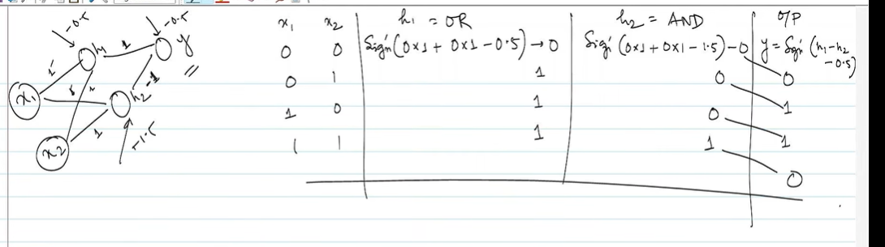

# Introduction to Deep Learning

* 1943 - McCulloch & Pitts
* One was neuroscientist and one was logician
* 1957-58
  * Frank Rosenblatt - The idea of neural network called it The Perceptron
* 1965-68 - Multi Layer Perceptron
* 1969 - Minskey & Papert
  * XOR cannot be modeled. It's called AI winter time(1969 to 1980)
* 1986 - Back Propagation method
* 1989 - Universal Approximation Theorem (UAT) was proposed
  * MLP - Multi layer perceptron with a single hidden layer can approximate any continous function
  * Go to formal deep learning course

* How neurons work?

* They realized there is problem with XOR

but the problem remains

# How to address this XOR function

* how MLP can mimic XOR Operation

