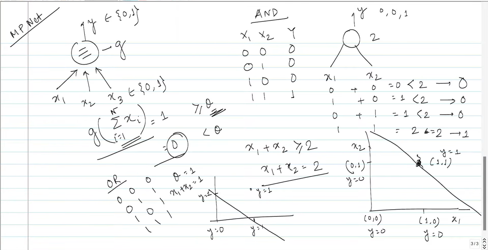

Yes. This page is explaining a **very important first step in neural networks: how a single artificial neuron can implement logical functions such as AND and OR.**

It is essentially moving from:

**biological neuron → mathematical neuron → logic gate → decision boundary**

Let's unpack the page from first principles.

---

# 1. The neuron at the top-left

The diagram shows something like:

$$
x_1,x_2,x_3 \rightarrow \boxed{\text{neuron}} \rightarrow y
$$

with:

$$
x_i\in{0,1}
$$

and

$$
y\in{0,1}
$$

This means the neuron is working with **binary inputs and binary output**.

For example:

$$
x_1=0,\quad x_2=1
$$

could represent one input being inactive and another being active.

The neuron takes these inputs and decides whether its output should be:

$$
y=0
$$

or

$$
y=1
$$

---

# 2. The basic mathematical rule

The important equation on the left is approximately:

$$
y=g\left(\sum_{i=1}^{n}x_i\right)
$$

The function (g) is a **threshold function**.

The idea is:

> Add up the inputs. If the total reaches a certain threshold, output 1. Otherwise output 0.

For example, suppose the threshold is:

$$
\theta=2
$$

Then:

$$
g(x)=
\begin{cases}
0 & x<2\
1 & x\geq2
\end{cases}
$$

So:

| Sum | Output |
| --: | -----: |
|   0 |      0 |
|   1 |      0 |
|   2 |      1 |
|   3 |      1 |

This is the basic idea behind a **threshold neuron**.

---

# 3. This is essentially a McCulloch–Pitts neuron

The "MP Net" written in the corner is referring to the **McCulloch–Pitts neuron**, one of the early mathematical models of a neuron.

The basic idea is remarkably simple:

$$
\boxed{\text{Sum inputs → compare with threshold → produce 0 or 1}}
$$

For this page, you don't need to think about modern neural networks yet.

Just understand:

> **A neuron can be treated as a decision-making mathematical unit.**

---

# 4. Then the lecturer applies this to an AND gate

Look at the table labelled **AND**.

You have:

| (x_1) | (x_2) | (y) |
| ----: | ----: | --: |
|     0 |     0 |   0 |
|     0 |     1 |   0 |
|     1 |     0 |   0 |
|     1 |     1 |   1 |

This is exactly the truth table of an AND gate.

The rule is:

$$
y=1
$$

**only when both inputs are 1.**

---

# 5. How does a neuron implement AND?

The lecturer chooses a threshold:

$$
\theta=2
$$

and calculates:

$$
x_1+x_2
$$

For each possible input:

### Case 1

$$
x_1=0,\quad x_2=0
$$

Therefore:

$$
0+0=0<2
$$

so:

$$
y=0
$$

---

### Case 2

$$
x_1=0,\quad x_2=1
$$

$$
0+1=1<2
$$

therefore:

$$
y=0
$$

---

### Case 3

$$
x_1=1,\quad x_2=0
$$

$$
1+0=1<2
$$

therefore:

$$
y=0
$$

---

### Case 4

$$
x_1=1,\quad x_2=1
$$

$$
1+1=2\geq2
$$

therefore:

$$
y=1
$$

And we have reproduced:

$$
\boxed{\text{AND}}
$$

using a neuron.

---

# 6. The OR gate

Then the page does the same thing for **OR**.

The OR truth table is:

| (x_1) | (x_2) | (y) |
| ----: | ----: | --: |
|     0 |     0 |   0 |
|     0 |     1 |   1 |
|     1 |     0 |   1 |
|     1 |     1 |   1 |

For OR, we only need the threshold to be:

$$
\theta=1
$$

Now:

$$
y=
\begin{cases}
0 & x_1+x_2<1\
1 & x_1+x_2\geq1
\end{cases}
$$

Check it.

### (0,0)

$$
0+0=0<1
$$

$$
y=0
$$

### (0,1)

$$
0+1=1\geq1
$$

$$
y=1
$$

### (1,0)

$$
1+0=1\geq1
$$

$$
y=1
$$

### (1,1)

$$
1+1=2\geq1
$$

$$
y=1
$$

Therefore:

$$
\boxed{\text{One threshold neuron can implement OR}}
$$

---

# 7. Now the graphs become interesting

This is probably the most important part of the page for understanding machine learning.

The lecturer has plotted (x_1) on one axis and (x_2) on the other.

Since both inputs are binary, there are only four possible points:

$$
(0,0),;(0,1),;(1,0),;(1,1)
$$

Think of them as four data points.

---

## AND

For AND:

$$
x_1+x_2\geq2
$$

means:

$$
x_2\geq2-x_1
$$

The boundary is:

$$
\boxed{x_1+x_2=2}
$$

This is the diagonal line drawn in the middle/bottom portion.

Only:

$$
(1,1)
$$

falls on the (y=1) side.

The other three points produce:

$$
y=0
$$

So the neuron is effectively drawing a line that separates:

$$
\boxed{\text{output 0}}
$$

from

$$
\boxed{\text{output 1}}
$$

---

# 8. OR has a different boundary

For OR:

$$
x_1+x_2\geq1
$$

The boundary is:

$$
\boxed{x_1+x_2=1}
$$

or:

$$
x_2=1-x_1
$$

This line separates:

$$
(0,0)
$$

from:

$$
(0,1),(1,0),(1,1)
$$

Therefore:

$$
(0,0)\rightarrow0
$$

and

$$
(0,1),(1,0),(1,1)\rightarrow1
$$

---

# 9. And THIS is the connection to machine learning

This page is secretly introducing the concept of a **decision boundary**.

The neuron is doing something like:

$$
w_1x_1+w_2x_2\geq\theta
$$

If the condition is true:

$$
y=1
$$

otherwise:

$$
y=0
$$

Geometrically, the equation

$$
w_1x_1+w_2x_2=\theta
$$

creates a line.

That line divides the input space into two regions.

So an artificial neuron is basically doing:

> **Draw a boundary and decide which side of the boundary the input belongs to.**

This is a foundational idea behind the **perceptron** and ultimately classification algorithms.

---

# 10. Notice something important: weights aren't shown yet

Your previous diagram introduced the general concept:

$$
y=f(w_1x_1+w_2x_2+\cdots+w_nx_n+b)
$$

But this page is using a simpler version:

$$
y=g(x_1+x_2)
$$

Effectively, the weights are:

$$
w_1=w_2=1
$$

and the threshold determines the decision.

For AND:

$$
\theta=2
$$

For OR:

$$
\theta=1
$$

Later, when you study the **perceptron**, you'll see the more general form:

$$
\boxed{y=g(w_1x_1+w_2x_2+b)}
$$

Now the model can **learn the weights** instead of us manually deciding them.

That's a major conceptual jump.

---

# 11. The whole page in one picture

Think about it like this:

```text
                Artificial neuron
                       │
                       ▼
              Add the inputs
                       │
                       ▼
             Compare with threshold
                       │
                ┌──────┴──────┐
                │             │
             below θ        ≥ θ
                │             │
                ▼             ▼
              y = 0         y = 1
```

For AND:

$$
\theta=2
$$

For OR:

$$
\theta=1
$$

Therefore:

$$
\boxed{\text{Neuron + threshold = logic gate}}
$$

And geometrically:

$$
\boxed{\text{Neuron = decision boundary}}
$$

---

# Your self-notes

I'd keep these notes from this lecture:

## Threshold Neuron / McCulloch–Pitts Neuron

A simple artificial neuron can receive binary inputs:

$$
x_i\in{0,1}
$$

and produce a binary output:

$$
y\in{0,1}
$$

The neuron calculates the sum of its inputs:

$$
s=\sum_i x_i
$$

and applies a threshold:

$$
y=
\begin{cases}
1 & s\geq\theta\
0 & s<\theta
\end{cases}
$$

where (\theta) is the threshold.

### AND gate

For two inputs:

$$
y=1 \iff x_1+x_2\geq2
$$

Therefore:

$$
\theta=2
$$

Truth table:

$$
00\rightarrow0
$$

$$
01\rightarrow0
$$

$$
10\rightarrow0
$$

$$
11\rightarrow1
$$

Decision boundary:

$$
\boxed{x_1+x_2=2}
$$

### OR gate

$$
y=1 \iff x_1+x_2\geq1
$$

Therefore:

$$
\theta=1
$$

Truth table:

$$
00\rightarrow0
$$

$$
01\rightarrow1
$$

$$
10\rightarrow1
$$

$$
11\rightarrow1
$$

Decision boundary:

$$
\boxed{x_1+x_2=1}
$$

### Important ML connection

A threshold neuron divides the input space into regions:

$$
\boxed{w_1x_1+w_2x_2+b\geq0\Rightarrow y=1}
$$

$$
\boxed{w_1x_1+w_2x_2+b<0\Rightarrow y=0}
$$

The separating line/plane is called a **decision boundary**.

Therefore:

> **A single artificial neuron can act as a binary classifier by creating a decision boundary.**

And this is the bridge from **logic gates → perceptron → machine learning classification → neural networks**.

### One thing to remember

Don't just memorize that "AND uses threshold 2 and OR uses threshold 1."

The deeper idea is:

$$
\boxed{
\text{Inputs}
\rightarrow
\text{weighted/summed evidence}
\rightarrow
\text{threshold}
\rightarrow
\text{decision}
}
$$

That idea will keep appearing when you study **perceptrons, activation functions, logistic regression, neural networks, loss functions, and backpropagation**.


