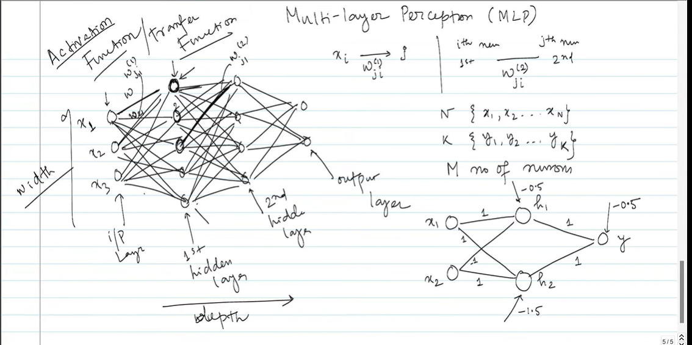
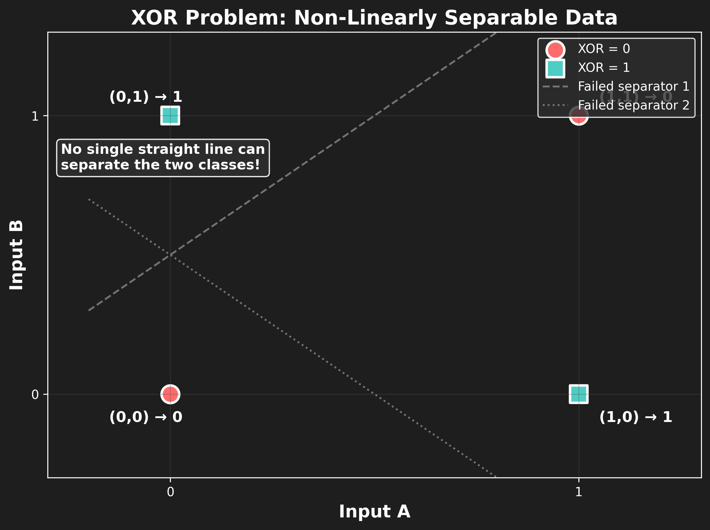

## how we are addressing XOR problem.




Yes. This page is showing the **classic solution to the XOR problem using a Multi-Layer Perceptron (MLP)**.

The key idea is:

> **A single perceptron cannot solve XOR, but multiple perceptrons arranged in layers can transform the problem into something that becomes linearly separable.**

Let's build this from first principles.

---

# 1. First: what exactly is the XOR problem?

XOR means **exclusive OR**.

It gives 1 when the two inputs are different, and 0 when they are the same.

| $(x_1)$ | $(x_2)$ | XOR |
| ----: | ----: | --: |
|     0 |     0 |   0 |
|     0 |     1 |   1 |
|     1 |     0 |   1 |
|     1 |     1 |   0 |

So geometrically:

* ((0,0)) → class 0
* ((1,1)) → class 0
* ((0,1)) → class 1
* ((1,0)) → class 1



Notice something important:

The two **0s are on one diagonal**, while the two **1s are on the other diagonal**.

There is **no single straight line** that can separate the 0s from the 1s.

That's the problem.

---

# 2. Why does a single perceptron fail?

A perceptron basically calculates

$$
z=w_1x_1+w_2x_2+b
$$

and then applies an activation function, for example a step function:

$$
y=
\begin{cases}
1 & z>0\
0 & z\leq0
\end{cases}
$$

The decision boundary is

$$
w_1x_1+w_2x_2+b=0
$$

which is a **straight line** in two dimensions.

Therefore a single perceptron can solve problems such as:

### AND

| $(x_1)$ | $(x_2)$ | AND |
| ----: | ----: | --: |
|     0 |     0 |   0 |
|     0 |     1 |   0 |
|     1 |     0 |   0 |
|     1 |     1 |   1 |

A straight line can separate ((1,1)) from the other three points.

### OR

| $(x_1)$ | $(x_2)$ | OR |
| ----: | ----: | -: |
|     0 |     0 |  0 |
|     0 |     1 |  1 |
|     1 |     0 |  1 |
|     1 |     1 |  1 |

Again, a straight line can separate the classes.

But XOR cannot.

---

# 3. The brilliant idea: don't solve XOR directly

This is where the **hidden layer** comes in.

Instead of asking one neuron:

> "Is this XOR?"

we create intermediate questions.

For example:

> **Neuron 1:** Is $(x_1)$ OR $(x_2)$ ?  
> **Neuron 2:** Is $(x_1)$ AND $(x_2)$ ?

Then the output neuron combines those answers.

This is exactly what your diagram is trying to illustrate.

---

# 4. Let's construct it ourselves

Let's make two hidden neurons.

Call them:

$$
h_1 = OR(x_1,x_2)
$$

and

$$
h_2 = AND(x_1,x_2)
$$

Their truth tables are:

| $(x_1)$ | $(x_2)$ | $(h_1=OR)$ | $(h_2=AND)$ |
| ----: | ----: | -------: | --------: |
|     0 |     0 |        0 |         0 |
|     0 |     1 |        1 |         0 |
|     1 |     0 |        1 |         0 |
|     1 |     1 |        1 |         1 |

Now look at that table carefully.

We have transformed the original inputs

$$
(x_1,x_2)
$$

into

$$
(h_1,h_2)
$$

So:

| Input | Hidden representation |
| ----- | --------------------- |
| (0,0) | (0,0)                 |
| (0,1) | (1,0)                 |
| (1,0) | (1,0)                 |
| (1,1) | (1,1)                 |

Now XOR has become:

| $(h_1)$ | $(h_2)$ | XOR |
| ----: | ----: | --: |
|     0 |     0 |   0 |
|     1 |     0 |   1 |
|     1 |     0 |   1 |
|     1 |     1 |   0 |

So we need the output neuron to perform:

$$
XOR = h_1 \ AND\ NOT(h_2)
$$

In words:

> **The OR condition must be true, but the AND condition must NOT be true.**

That's the trick.

---

# 5. How does a neuron implement OR?

Remember:

$$
z=w_1x_1+w_2x_2+b
$$

Suppose we choose

$$
w_1=1,\qquad w_2=1,\qquad b=-0.5
$$

Then

$$
z=x_1+x_2-0.5
$$

Using a step activation:

### $(x_1=0,x_2=0)$

$$
z=0+0-0.5=-0.5
$$

so

$$
h_1=0
$$

### $(x_1=0,x_2=1)$

$$
z=0+1-0.5=0.5
$$

so

$$
h_1=1
$$

### $(x_1=1,x_2=0)$

$$
z=1+0-0.5=0.5
$$

so

$$
h_1=1
$$

### $(x_1=1,x_2=1)$

$$
z=1+1-0.5=1.5
$$

so

$$
h_1=1
$$

Therefore:

$$
h_1=OR(x_1,x_2)
$$

---

# 6. Another hidden neuron can implement AND

Choose

$$
w_1=1,\qquad w_2=1,\qquad b=-1.5
$$

Then

$$
z=x_1+x_2-1.5
$$

For the four inputs:

| $(x_1)$ | $(x_2)$ |  $(z)$ | $(h_2)$ |
| ----: | ----: | ---: | ----: |
|     0 |     0 | -1.5 |     0 |
|     0 |     1 | -0.5 |     0 |
|     1 |     0 | -0.5 |     0 |
|     1 |     1 |  0.5 |     1 |

Therefore:

$$
h_2=AND(x_1,x_2)
$$

And this is very close to the numbers you have written in your notebook: **weights of 1 and a bias around (-1.5)**.

---

# 7. Now the output neuron

We now have:

$$
h_1=OR
$$

and

$$
h_2=AND
$$

We want:

$$
y=h_1\ AND\ NOT(h_2)
$$

One possible output-neuron implementation is:

$$
z=h_1-2h_2-0.5
$$

and

$$
y=\text{step}(z)
$$

Let's test it.

### Input: (0,0)

Hidden layer:

$$
h_1=0,\quad h_2=0
$$

Therefore:

$$
z=0-0-0.5=-0.5
$$

$$
y=0
$$

Correct.

---

### Input: (0,1)

$$
h_1=1,\quad h_2=0
$$

Therefore:

$$
z=1-0-0.5=0.5
$$

$$
y=1
$$

Correct.

---

### Input: (1,0)

Again:

$$
h_1=1,\quad h_2=0
$$

so

$$
y=1
$$

Correct.

---

### Input: (1,1)

Now:

$$
h_1=1,\quad h_2=1
$$

Therefore:

$$
z=1-2(1)-0.5=-1.5
$$

so

$$
y=0
$$

Correct!

Therefore:

$$
\boxed{XOR=(OR)\ AND\ NOT(AND)}
$$

---

# 8. So what has the hidden layer actually accomplished?

This is the **most important conceptual point**.

The hidden layer isn't merely "adding more neurons."

It is **changing the representation of the data**.

Originally:

$$
(x_1,x_2)
$$

gave us this arrangement:

```text
       x2
        ↑
    1   |   0
        |
   -----+----→ x1
    0   |   1
```

The classes aren't linearly separable.

But the hidden layer transforms the points into a new space:

$$
(x_1,x_2)\rightarrow(h_1,h_2)
$$

The hidden neurons essentially **bend/transform the representation** so that the output neuron can separate the classes.

This is one of the deepest ideas behind neural networks.

> **A neural network can learn useful intermediate representations that make a difficult problem easier for the next layer.**

---

# 9. Why is this called a Multi-Layer Perceptron?

Your diagram has:

$$
\text{Input Layer}
\rightarrow
\text{Hidden Layer 1}
\rightarrow
\text{Hidden Layer 2}
\rightarrow
\text{Output Layer}
$$

or, depending on the exact architecture being illustrated, one or more hidden layers.

Each connection has a weight:

$$
w_{ji}^{(l)}
$$

Your notebook also appears to be discussing the notation for weights changing from one layer to another:

$$
w_{ji}^{(l)}
$$

The basic computation at a neuron is always:

$$
z_j=\sum_i w_{ji}x_i+b_j
$$

followed by an activation:

$$
a_j=f(z_j)
$$

The important thing is that the output of one layer becomes the input to the next:

$$
x
\rightarrow
h
\rightarrow
y
$$

So the network is **composing functions**:

$$
y=f_3(f_2(f_1(x)))
$$

That composition is what gives the network much more expressive power than a single perceptron.

---

# 10. One subtle but VERY important point

There are two different things you should keep separate:

### A. The hand-designed XOR example

We just chose weights deliberately:

$$
h_1=OR
$$

$$
h_2=AND
$$

and then constructed the output.

This is useful for **understanding why an MLP can solve XOR**.

### B. What happens in real neural-network training

In an actual neural network, we generally **don't tell the network**:

> "This neuron should become OR and this one should become AND."

Instead, we initialize weights, calculate the error, and use **backpropagation + gradient descent** to adjust the weights.

Eventually, the hidden neurons may learn representations that solve the problem.

They don't necessarily correspond neatly to "OR neuron" and "AND neuron."

That's an important distinction.

---

# 11. Why this was historically important

The XOR problem became famous because it demonstrated a limitation of the **single-layer perceptron**.

A single perceptron can only create a linear decision boundary.

But:

$$
\boxed{\text{XOR is not linearly separable}}
$$

Adding a hidden layer changes the situation:

$$
\boxed{\text{Hidden layers allow nonlinear representations}}
$$

and therefore:

$$
\boxed{\text{MLPs can solve XOR}}
$$

This is one of the foundational ideas behind modern neural networks.

---

# Short study notes

## XOR Problem

### XOR truth table

| $(x_1)$ | $(x_2)$ | $(y)$ |
| ----: | ----: | --: |
|     0 |     0 |   0 |
|     0 |     1 |   1 |
|     1 |     0 |   1 |
|     1 |     1 |   0 |

### Problem with a single perceptron

A perceptron creates:

$$
w_1x_1+w_2x_2+b=0
$$

which is a **linear decision boundary**.

XOR is **not linearly separable**, so one perceptron cannot solve it.

### MLP solution

Introduce hidden neurons:

$$
h_1=OR(x_1,x_2)
$$

$$
h_2=AND(x_1,x_2)
$$

Then:

$$
XOR=h_1\ AND\ NOT(h_2)
$$

One possible implementation:

$$
h_1=\text{step}(x_1+x_2-0.5)
$$

$$
h_2=\text{step}(x_1+x_2-1.5)
$$

$$
y=\text{step}(h_1-2h_2-0.5)
$$

### Core idea

$$
\boxed{
\text{Input}
\rightarrow
\text{Hidden representation}
\rightarrow
\text{Output}
}
$$

The hidden layer **transforms the input representation**, making a problem that was not linearly separable easier for the output neuron to classify.

### Remember this sentence

> **A single perceptron cannot solve XOR because XOR is not linearly separable; an MLP solves it by using hidden neurons to transform the input into a new representation.**

And this is the conceptual bridge from **perceptrons → hidden layers → backpropagation → deep learning**.

