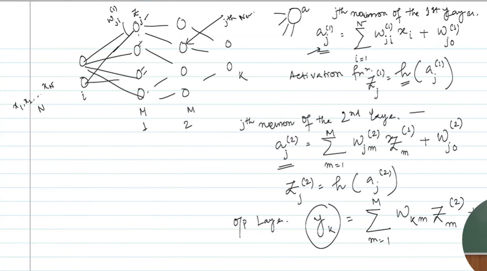

Exactly. This page is moving from the **conceptual MLP diagram** we discussed earlier to the **mathematical calculation performed by the network**.

In simple terms:

> **We are trying to calculate the output of the neural network for a given input.**

This is called the **forward pass / forward propagation**.

---

# 1. Start with the input

On the left you have (N) input neurons:

$$
x_1,x_2,\ldots,x_N
$$

These are the values given to the neural network.

For example, in the XOR problem:

$$
x_1=1,\qquad x_2=0
$$

So the network starts with:

$$
\boxed{x=(x_1,x_2)}
$$

---

# 2. Calculate the first hidden layer

Your notes say:

$$
a_j^{(1)}
=========

\sum_{i=1}^{N}w_{ji}^{(1)}x_i+w_{j0}^{(1)}
$$

Let's decode this.

### (j)

(j) tells us **which neuron in the first hidden layer** we're calculating.

There are (M) neurons in that layer.

So:

$$
j=1,2,\ldots,M
$$

### (i)

(i) tells us which input we're taking.

$$
i=1,2,\ldots,N
$$

### (w_{ji}^{(1)})

This is the **weight connecting input (i) to hidden neuron (j)**.

So essentially:

$$
\boxed{\text{weighted sum of inputs}}
$$

plus a bias.

---

# 3. Why are we calculating (a_j^{(1)})?

Suppose there are two inputs and one hidden neuron.

Then:

$$
a_1^{(1)}
=========

w_{11}^{(1)}x_1+
w_{12}^{(1)}x_2+
w_{10}^{(1)}
$$

This is just:

$$
\boxed{\text{input}_1\times\text{weight}_1+
\text{input}_2\times\text{weight}_2+
\text{bias}}
$$

Nothing mysterious is happening.

---

# 4. Then comes the activation function

Your notes say:

$$
z_j^{(1)}=h(a_j^{(1)})
$$

So the neuron first calculates:

$$
a_j^{(1)}
$$

and then passes it through an activation function (h).

For example, if we're using ReLU:

$$
h(a)=\max(0,a)
$$

then:

$$
z_j^{(1)}
=========

\max(0,a_j^{(1)})
$$

So each neuron is doing:

$$
\boxed{
\text{weighted sum}
\rightarrow
\text{activation}
}
$$

---

# 5. The important thing: the hidden layer's output becomes the next layer's input

This is the heart of the diagram.

We started with:

$$
x_1,x_2,\ldots,x_N
$$

We calculated:

$$
z_1^{(1)},z_2^{(1)},\ldots,z_M^{(1)}
$$

Now these (M) values are passed to the **second hidden layer**.

So conceptually:

$$
\boxed{
x
\rightarrow
z^{(1)}
\rightarrow
z^{(2)}
\rightarrow
y
}
$$

---

# 6. Calculate the second hidden layer

Your notes have:

$$
a_j^{(2)}
=========

\sum_{m=1}^{M}w_{jm}^{(2)}z_m^{(1)}
+
w_{j0}^{(2)}
$$

Same operation again!

But notice the difference.

Previously:

$$
a_j^{(1)}
=========

\sum_i w_{ji}^{(1)}x_i+w_{j0}^{(1)}
$$

Now:

$$
a_j^{(2)}
=========

\sum_m w_{jm}^{(2)}z_m^{(1)}
+w_{j0}^{(2)}
$$

The **inputs have changed**.

Previously the input was (x_i).

Now the input is the output of the previous layer:

$$
z_m^{(1)}
$$

Then again:

$$
z_j^{(2)}=h(a_j^{(2)})
$$

So the second hidden layer also performs:

$$
\boxed{
\text{weighted sum}
\rightarrow
\text{activation}
}
$$

---

# 7. Finally, calculate the output

At the bottom your notes have something like:

$$
y_k=\sum_{m=1}^{M}w_{km}z_m^{(2)}
$$

This is the **output layer**.

It takes the values produced by the previous layer and combines them to produce the final prediction.

For example, if this is a binary classification problem, the output might eventually represent:

$$
y=0
$$

or

$$
y=1
$$

---

# 8. So what are we actually doing?

We're simply passing information from **left to right**.

Your diagram can be understood as:

$$
\boxed{
\text{Input}
\rightarrow
\text{Weighted sum}
\rightarrow
\text{Activation}
\rightarrow
\text{Weighted sum}
\rightarrow
\text{Activation}
\rightarrow
\text{Output}
}
$$

More concretely:

$$
x
$$

↓

### Layer 1

$$
a^{(1)}=W^{(1)}x+b^{(1)}
$$

↓

$$
z^{(1)}=h(a^{(1)})
$$

↓

### Layer 2

$$
a^{(2)}=W^{(2)}z^{(1)}+b^{(2)}
$$

↓

$$
z^{(2)}=h(a^{(2)})
$$

↓

### Output

$$
y=W^{(3)}z^{(2)}+b^{(3)}
$$

That's the **forward pass**.

---

# 9. Connect this to the XOR example

This is particularly useful because of what we discussed just before.

For XOR, we had:

$$
x_1,x_2
$$

going into hidden neurons.

The hidden neurons transform the original representation:

$$
(x_1,x_2)
\longrightarrow
(z_1^{(1)},z_2^{(1)},\ldots)
$$

Then another layer can transform it again:

$$
z^{(1)}
\longrightarrow
z^{(2)}
$$

and eventually:

$$
z^{(2)}\longrightarrow y
$$

So the neural network is essentially **building increasingly useful representations of the original input**.

---

# 10. One thing to notice about the notation

The superscript ((1),(2)) does **not** mean power.

For example:

$$
w_{ji}^{(1)}
$$

doesn't mean (w_{ji}) raised to the power 1.

It means:

> **the weight belonging to layer 1.**

Similarly:

$$
a_j^{(2)}
$$

means:

> the pre-activation value of neuron (j) in layer 2.

And:

$$
z_j^{(2)}
$$

means:

> the activated output of neuron (j) in layer 2.

---

## The big picture

What your professor is doing here is transitioning from:

**"Here is an MLP architecture."**

to:

**"Let's mathematically calculate what this MLP does when we give it an input."**

So this page is essentially introducing the **forward propagation equations**.

And once you understand this, the natural next question is:

> **Okay, we can calculate the output. But how do we know whether the output is good, and how do we change all these weights to make it better?**

That leads directly to **loss function → gradient → backpropagation → gradient descent**, which is the next major piece of the MLP story.
