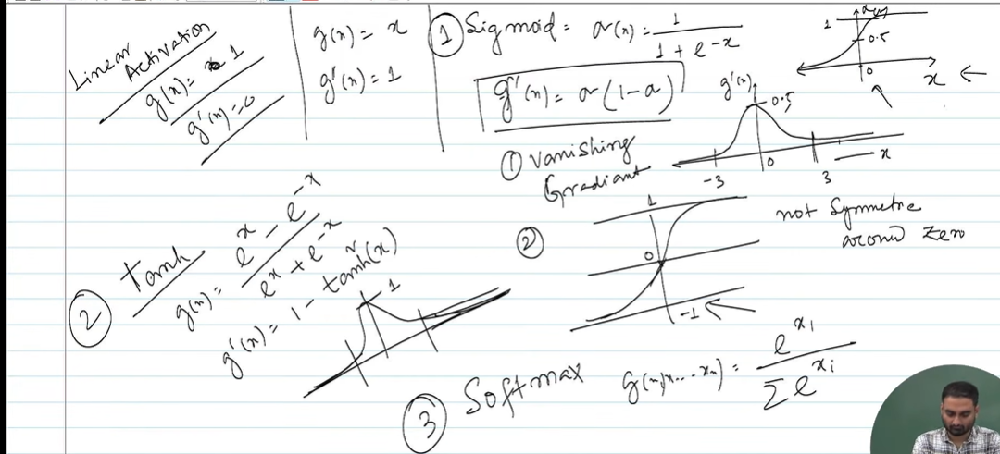
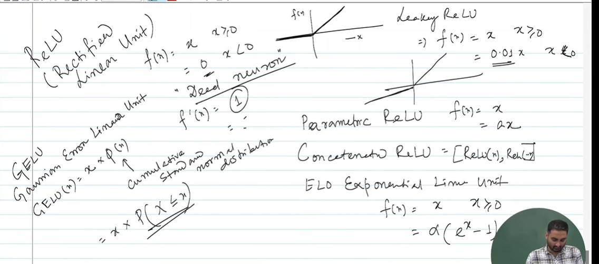

Yes. This lecture is now moving to the **next important piece of an MLP: activation functions**.

If the previous image was about:

> **"How does an MLP calculate its output?"**

this image is about:

> **"What activation function should we put inside the neurons, and why does the choice matter for learning?"**

The instructor is mainly discussing **Linear, Sigmoid, Tanh, and Softmax**, with special attention to **derivatives and the vanishing-gradient problem**.

Let's build it from first principles.

---

# 1. First principles: what does a neuron actually calculate?

From the previous image, a neuron first calculates a weighted sum:

$$
a = w_1x_1+w_2x_2+\cdots+w_nx_n+b
$$

Then we apply some function to it:

$$
z=g(a)
$$

Here (g) is the **activation function**.

So a neuron is basically:

$$
\boxed{
\text{inputs}
\rightarrow
\text{weighted sum}
\rightarrow
\text{activation}
\rightarrow
\text{output}
}
$$

Why do we need this extra function?

That is the key question.

---

# 2. Why not simply use the weighted sum?

Suppose we don't use an activation function.

Then:

$$
z=a
$$

which means:

$$
z=w_1x_1+w_2x_2+b
$$

Now imagine stacking many layers:

$$
x
\rightarrow
W_1x+b_1
\rightarrow
W_2(...)
+b_2
\rightarrow
W_3(...)
+b_3
$$

Although there are many layers, mathematically this whole thing can still be reduced to:

$$
z=Wx+b
$$

In other words:

> **Stacking linear transformations without nonlinear activation functions still gives you one linear transformation.**

So the hidden layers wouldn't give us the expressive power we want.

This is why we introduce a **nonlinear activation function**.

---

# 3. The first one in your notes: Linear activation

Your instructor writes:

$$
g(n)=n
$$

and:

$$
g'(n)=1
$$

This is the linear activation function.

Graphically:

$$
y=x
$$

It simply passes the value through unchanged.

For example:

$$
a=5
$$

then:

$$
g(a)=5
$$

---

## Why is its derivative important?

The derivative is:

$$
g'(a)=1
$$

That means the gradient doesn't get smaller because of this activation function.

But there is a major problem:

> **Linear activation doesn't introduce nonlinearity.**

Therefore, we generally don't use it in hidden layers of a neural network.

It is sometimes useful in the **output layer**, especially for regression.

For example, predicting:

* house price
* temperature
* salary
* height

These values aren't naturally restricted to 0–1, so a linear output can make sense.

---

# 4. Then the instructor introduces Sigmoid

Your notes show:

$$
\sigma(x)=\frac{1}{1+e^{-x}}
$$

This is the **sigmoid activation function**.

Its graph looks like an S:

```text
y
1 |                    ______
  |                ___/
  |             __/
0.5|----------/
  |        __/
  |     __/
0 |____/
  +---------------------- x
```

Its output is always between:

$$
0<\sigma(x)<1
$$

So:

$$
\boxed{\sigma(x)\in(0,1)}
$$

This makes it particularly useful when we want something that resembles a probability.

For example:

$$
\sigma(2)\approx0.88
$$

could be interpreted as roughly an 88% probability.

---

# 5. Why is sigmoid useful for binary classification?

Suppose you're predicting:

> Is this email spam?

You could define:

$$
y=0
$$

for not spam and

$$
y=1
$$

for spam.

The sigmoid function converts an arbitrary number into something between 0 and 1.

For example:

$$
a=-5
$$

gives approximately:

$$
\sigma(a)\approx0.007
$$

while:

$$
a=5
$$

gives:

$$
\sigma(a)\approx0.993
$$

So the network can output something that looks like a probability.

---

# 6. But now comes the important part: the derivative

Your instructor writes:

$$
\boxed{\sigma'(x)=\sigma(x)(1-\sigma(x))}
$$

This equation is extremely important.

Let's call:

$$
y=\sigma(x)
$$

Then:

$$
\sigma'(x)=y(1-y)
$$

What is the largest this derivative can become?

At:

$$
y=0.5
$$

we get:

$$
\sigma'(x)=0.5(1-0.5)
$$

$$
=0.25
$$

So:

$$
\boxed{\sigma'(x)\leq0.25}
$$

This is what your instructor is getting at with the graph of the derivative.

---

# 7. Why does that create a problem?

Remember that neural networks learn using **gradients**.

And gradients are calculated using the **chain rule**.

Suppose we have:

$$
x
\rightarrow
\text{Layer 1}
\rightarrow
\text{Layer 2}
\rightarrow
\text{Layer 3}
$$

During backpropagation, gradients are multiplied together:

$$
\frac{\partial L}{\partial x}
=
\frac{\partial L}{\partial z_3}
\frac{\partial z_3}{\partial z_2}
\frac{\partial z_2}{\partial z_1}
\frac{\partial z_1}{\partial x}
$$

If each sigmoid derivative is at most:

$$
0.25
$$

then imagine multiplying several of them:

$$
0.25\times0.25\times0.25\times0.25
$$

That's:

$$
0.00390625
$$

After many layers, it can become **extremely tiny**.

This is the:

$$
\boxed{\text{vanishing gradient problem}}
$$

which your instructor has written on the page.

---

# 8. What does "vanishing gradient" actually mean?

Suppose the network has:

$$
L_1\rightarrow L_2\rightarrow L_3\rightarrow L_4\rightarrow L_5
$$

During backpropagation, information about the error needs to travel backward.

If the gradients become:

$$
0.1,\quad0.01,\quad0.001,\quad0.0001,\ldots
$$

then the earlier layers receive almost no useful signal.

Consequently:

$$
\boxed{\text{early layers learn extremely slowly}}
$$

That's why it's called **vanishing gradient**.

The gradient hasn't literally disappeared mathematically in every case; it has become so small that learning becomes ineffective.

---

# 9. Another problem with sigmoid: it isn't zero-centered

Your instructor has written:

> **not symmetric around zero**

This is another disadvantage of sigmoid.

Sigmoid produces:

$$
(0,1)
$$

It is always positive.

It is not centered around zero.

Compare:

$$
\tanh(x)\in(-1,1)
$$

which **is** zero-centered.

This can make optimization less convenient for some networks.

---

# 10. Then comes Tanh

Your instructor writes:

$$
g(n)=\frac{e^x-e^{-x}}{e^x+e^{-x}}
$$

which is:

$$
\boxed{\tanh(x)}
$$

Its output is:

$$
\boxed{-1<\tanh(x)<1}
$$

Its graph looks roughly like:

```text
 1 |              ______
   |           __/
   |        __/
 0 |-------/
   |     __
   |   _/
-1 |___
   +---------------- x
```

Notice something important.

Sigmoid:

$$
(0,1)
$$

Tanh:

$$
(-1,1)
$$

So tanh is **zero-centered**.

---

# 11. Why might tanh be better than sigmoid?

Because its derivative is:

$$
\boxed{\tanh'(x)=1-\tanh^2(x)}
$$

At (x=0):

$$
\tanh(0)=0
$$

so:

$$
\tanh'(0)=1
$$

That's much larger than sigmoid's maximum derivative of:

$$
0.25
$$

Therefore, around the central region, gradients can flow better through tanh.

---

# 12. But tanh still has a vanishing-gradient problem

This is important.

Tanh isn't magically immune to vanishing gradients.

For very large positive (x):

$$
\tanh(x)\rightarrow1
$$

and therefore:

$$
\tanh'(x)\rightarrow0
$$

For very large negative (x):

$$
\tanh(x)\rightarrow-1
$$

and again:

$$
\tanh'(x)\rightarrow0
$$

So the graph has **saturation regions**.

The derivative becomes tiny there.

Therefore:

$$
\boxed{\text{tanh can also suffer from vanishing gradients}}
$$

This is why the later development of activation functions such as **ReLU** became important.

---

# 13. Finally: Softmax

At the bottom of your image, your instructor writes:

$$
g(x_1,\ldots,x_n)_i
=
\frac{e^{x_i}}
{\sum_j e^{x_j}}
$$

This is the **softmax function**.

Unlike sigmoid, softmax is generally used when you have **multiple mutually exclusive classes**.

For example:

> What is this image?

Suppose the possible classes are:

$$
\text{Cat},\quad\text{Dog},\quad\text{Horse}
$$

The network might produce raw outputs:

$$
2.0,;1.0,;0.1
$$

These are called **logits**.

Softmax converts them into probabilities.

Something approximately like:

$$
0.66,;0.24,;0.10
$$

and importantly:

$$
0.66+0.24+0.10=1
$$

So softmax gives us a probability distribution over the classes.

---

# 14. Why does softmax use (e^x)?

Look at:

$$
\frac{e^{x_i}}{\sum_j e^{x_j}}
$$

Exponentiation has a useful property:

> A slightly larger input becomes disproportionately larger.

For example:

$$
e^2\approx7.39
$$

while:

$$
e^1\approx2.72
$$

So softmax emphasizes the largest logit.

Then dividing by the total makes everything add up to 1.

---

# 15. Sigmoid vs Softmax

This distinction is worth remembering.

### Binary classification

Usually:

$$
\boxed{\text{Sigmoid}}
$$

Example:

> Spam vs not spam

Output:

$$
P(\text{spam})
$$

---

### Multi-class classification

Usually:

$$
\boxed{\text{Softmax}}
$$

Example:

> Cat vs dog vs horse

Output:

$$
P(\text{cat}),P(\text{dog}),P(\text{horse})
$$

and:

$$
\sum_iP_i=1
$$

---

# 16. So what is the instructor's overall story?

The lecture is actually following a logical sequence.

### Step 1 — We have a neuron

$$
a=Wx+b
$$

### Step 2 — We need an activation function

$$
z=g(a)
$$

because otherwise stacking layers gives us essentially just another linear function.

### Step 3 — Different activation functions have different properties

| Activation | Output                     | Important property                     |
| ---------- | -------------------------- | -------------------------------------- |
| Linear     | ((-\infty,\infty))         | No nonlinearity                        |
| Sigmoid    | ((0,1))                    | Good for binary output, but saturation |
| Tanh       | ((-1,1))                   | Zero-centered, but saturation          |
| Softmax    | probabilities summing to 1 | Multi-class output                     |

### Step 4 — Derivatives matter

Because learning uses gradients:

$$
\boxed{\text{backpropagation}\rightarrow\text{chain rule}\rightarrow\text{derivatives}}
$$

Therefore, the shape of the activation function's derivative matters enormously.

### Step 5 — Sigmoid/tanh can cause vanishing gradients

If:

$$
|g'(x)|<1
$$

repeated multiplication during backpropagation can make:

$$
\prod_i g'(x_i)
$$

very small.

Hence:

$$
\boxed{\text{Vanishing gradients}}
$$

---

# 17. The deeper connection to what you just learned

This is actually connecting **three lectures/concepts** together:

### Lecture 1 — Why do we need hidden layers?

XOR showed us:

$$
\text{single linear neuron}
\quad\rightarrow\quad
\text{not enough}
$$

So we introduced:

$$
\boxed{\text{MLP}}
$$

---

### Lecture 2 — How does an MLP calculate?

You just saw:

$$
a^{(l)}=W^{(l)}z^{(l-1)}+b^{(l)}
$$

and

$$
z^{(l)}=h(a^{(l)})
$$

This is the **forward pass**.

---

### Lecture 3 — What should (h) be?

That's what this image is answering.

$$
\boxed{h=\text{activation function}}
$$

And now the instructor is asking:

> Which activation should we use, and what happens to its derivative during backpropagation?

That naturally leads to the next major topic:

$$
\boxed{
\text{Activation functions}
\rightarrow
\text{Loss}
\rightarrow
\text{Gradient}
\rightarrow
\text{Backpropagation}
\rightarrow
\text{Gradient Descent}
}
$$

So the **vanishing-gradient discussion isn't a random side topic**. It is preparing you to understand **why certain activation functions are preferred in deep neural networks and why ReLU became so important**.


# Continued



Yep — this page is basically the **continuation of the previous activation-function discussion**.

The instructor has now moved from:

> **Sigmoid/Tanh have vanishing-gradient problems**

to:

> **"So what activation functions can we use instead?"**

And the main character here is **ReLU**.

---

# 1. ReLU — the basic idea

Your instructor writes:

$$
f(x)=
\begin{cases}
x & x\geq0\
0 & x<0
\end{cases}
$$

This is **ReLU**:

$$
\boxed{\text{ReLU}(x)=\max(0,x)}
$$

So it simply says:

* If (x) is positive → keep it.
* If (x) is negative → make it zero.

For example:

$$
ReLU(5)=5
$$

$$
ReLU(-3)=0
$$

$$
ReLU(0)=0
$$

Its graph looks like:

```text
       /
      /
     /
----+----------> x
    0
```

That's why it's called **Rectified Linear Unit**.

---

# 2. Why is ReLU interesting after sigmoid/tanh?

Remember the problem we just discussed.

Sigmoid:

$$
\sigma'(x)=\sigma(x)(1-\sigma(x))
$$

Its derivative can become very small.

Tanh also has regions where:

$$
\tanh'(x)\approx0
$$

So during backpropagation, gradients can shrink:

$$
0.2\times0.2\times0.2\times\cdots
$$

and we get:

$$
\boxed{\text{vanishing gradients}}
$$

ReLU behaves differently.

For positive (x):

$$
ReLU(x)=x
$$

therefore:

$$
ReLU'(x)=1
$$

So when the neuron is in its positive region, the gradient is **1**, rather than some tiny number.

That's a major reason ReLU became so popular.

---

# 3. But ReLU has a problem too

Look at the negative side.

For:

$$
x<0
$$

we have:

$$
ReLU(x)=0
$$

and therefore:

$$
ReLU'(x)=0
$$

So imagine a neuron has a very negative input.

Its output becomes:

$$
0
$$

and its gradient becomes:

$$
0
$$

That neuron may effectively stop learning.

This is called the:

$$
\boxed{\text{dying ReLU problem}}
$$

So ReLU solves one problem but introduces another.

---

# 4. That's why your instructor is now showing variations of ReLU

The rest of this page appears to be a quick survey of **different ReLU-family activation functions**.

---

## A. Leaky ReLU

Your instructor writes approximately:

$$
f(x)=
\begin{cases}
x & x\geq0\
0.01x & x<0
\end{cases}
$$

Instead of completely killing negative values, we allow a **small negative slope**.

So:

$$
ReLU(-5)=0
$$

but:

$$
LeakyReLU(-5)=0.01(-5)=-0.05
$$

The graph becomes:

```text
          /
         /
        /
-------+--------→ x
      /
     /
```

There is now a tiny slope on the negative side.

Therefore:

$$
f'(x)=
\begin{cases}
1 & x>0\
0.01 & x<0
\end{cases}
$$

So the gradient isn't completely zero on the negative side.

---

# 5. Parametric ReLU

Your instructor then writes:

$$
f(x)=
\begin{cases}
x & x\geq0\
\alpha x & x<0
\end{cases}
$$

This is **Parametric ReLU (PReLU)**.

The difference from Leaky ReLU is subtle but important.

For Leaky ReLU:

$$
\alpha
$$

is usually a **fixed small value**, such as:

$$
0.01
$$

For PReLU:

$$
\boxed{\alpha\text{ is learned from the data}}
$$

So instead of saying:

> "Let's arbitrarily use 0.01."

the network can learn the appropriate negative slope.

---

# 6. Concatenated ReLU

Your instructor also writes something like:


$$
\operatorname{ReLU}(x),\operatorname{ReLU}(-x)
$$


This is **Concatenated ReLU (CReLU)**.

Let's understand what happens.

Suppose:

$$
x=3
$$

Then:

$$
ReLU(3)=3
$$

and:

$$
ReLU(-3)=0
$$

So output becomes:


$$3,0$$


Now suppose:

$$
x=-3
$$

Then:

$$
ReLU(-3)=0
$$

while:

$$
ReLU(3)=3
$$

so output becomes:


$$0,3$$


The idea is that instead of throwing away the negative information, we represent positive and negative parts separately.

---

# 7. ELU — Exponential Linear Unit

At the bottom your instructor writes something like:

$$
f(x)=
\begin{cases}
x & x\geq0\
\alpha(e^x-1) & x<0
\end{cases}
$$

This is **ELU**.

For positive values, it behaves exactly like ReLU:

$$
f(x)=x
$$

For negative values, instead of becoming exactly zero, it smoothly approaches:

$$
-\alpha
$$

as (x\rightarrow-\infty).

So unlike ReLU:

$$
\text{negative input}\rightarrow\text{negative output}
$$

rather than:

$$
\text{negative input}\rightarrow0
$$

---

# 8. So why is the instructor showing all these?

There is a clear story behind the page:

### Sigmoid

Good nonlinear function, but:

$$
\boxed{\text{vanishing gradients}}
$$

and not zero-centered.

↓

### Tanh

Zero-centered and generally better than sigmoid for hidden layers, but:

$$
\boxed{\text{still suffers from saturation/vanishing gradients}}
$$

↓

### ReLU

For positive inputs:

$$
f'(x)=1
$$

So it helps with vanishing gradients and is computationally simple.

But:

$$
x<0\Rightarrow f'(x)=0
$$

↓

### Leaky ReLU / PReLU / CReLU / ELU

These are attempts to **improve the weaknesses of ordinary ReLU**.

---

# 9. One very useful way to remember the evolution

Think of it as an engineering progression:

$$
\boxed{\text{Sigmoid}}
$$

↓

**Problem:** gradients become tiny.

$$
\boxed{\text{Tanh}}
$$

↓

**Improvement:** zero-centered.

**Remaining problem:** gradients can still vanish.

$$
\boxed{\text{ReLU}}
$$

↓

**Improvement:** derivative is 1 for positive values.

**New problem:** derivative is 0 for negative values → dying neurons.

$$
\boxed{\text{Leaky ReLU / PReLU / ELU}}
$$

↓

**Idea:** keep some gradient/information on the negative side.

---

# 10. One correction/nuance to keep in mind

Don't interpret this as:

> "ReLU completely solves the vanishing-gradient problem."

That's too strong.

More accurately:

> **ReLU greatly reduces the saturation/vanishing-gradient problem on its positive side because its derivative is 1 there.**

But negative inputs have:

$$
ReLU'(x)=0
$$

which creates the **dying ReLU** issue.

Also, in modern neural networks, the actual choice of activation depends on architecture, optimization behavior, normalization, initialization, etc. The lecture is giving you the fundamental progression, not saying there is one universally best activation.

---

# 11. Connecting this to your MLP equations

Earlier you had:

$$
a_j^{(1)}
=
\sum_i w_{ji}^{(1)}x_i+b_j^{(1)}
$$

and then:

$$
z_j^{(1)}=h(a_j^{(1)})
$$

The (h) in that equation is **exactly what this lecture is discussing**.

For example, if we choose ReLU:

$$
z_j^{(1)}
=
ReLU(a_j^{(1)})
$$

Then the next layer does:

$$
a_j^{(2)}
=
\sum_m w_{jm}^{(2)}z_m^{(1)}
+b_j^{(2)}
$$

and again:

$$
z_j^{(2)}
=
ReLU(a_j^{(2)})
$$

So the whole MLP might look like:

$$
\boxed{
x
\rightarrow
Wx+b
\rightarrow
ReLU
\rightarrow
Wx+b
\rightarrow
ReLU
\rightarrow
Wx+b
\rightarrow
y
}
$$

And **now you can see why the activation function matters so much**: it sits inside every hidden layer and directly affects how gradients flow backward during training.

---

## Short study notes

**ReLU**

$$
\boxed{ReLU(x)=\max(0,x)}
$$

$$
ReLU'(x)=
\begin{cases}
1 & x>0\
0 & x<0
\end{cases}
$$

**Advantage:** simple, fast, helps reduce vanishing gradients for positive activations.

**Problem:** zero gradient for negative inputs → **dying ReLU**.

**Leaky ReLU**

$$
f(x)=
\begin{cases}
x & x\ge0\
\alpha x & x<0
\end{cases}
$$

Keeps a small gradient for negative (x).

**PReLU:** same idea, but (\alpha) is **learned**.

**CReLU:**


$$ReLU(x),ReLU(-x)$$


Keeps positive and negative information in separate components.

**ELU:**

$$
f(x)=
\begin{cases}
x & x\ge0\
\alpha(e^x-1)&x<0
\end{cases}
$$

Smooth negative-side behavior and allows negative outputs.

**Big picture:**

$$
\boxed{
\text{Sigmoid/Tanh}
\rightarrow
\text{vanishing gradient}
\rightarrow
\text{ReLU}
\rightarrow
\text{dying ReLU}
\rightarrow
\text{Leaky/PReLU/ELU/etc.}
}
$$

So this page is essentially the instructor answering: **"Now that we know why activation functions are needed, which nonlinear activation should we use, and what are the trade-offs of each?"**


