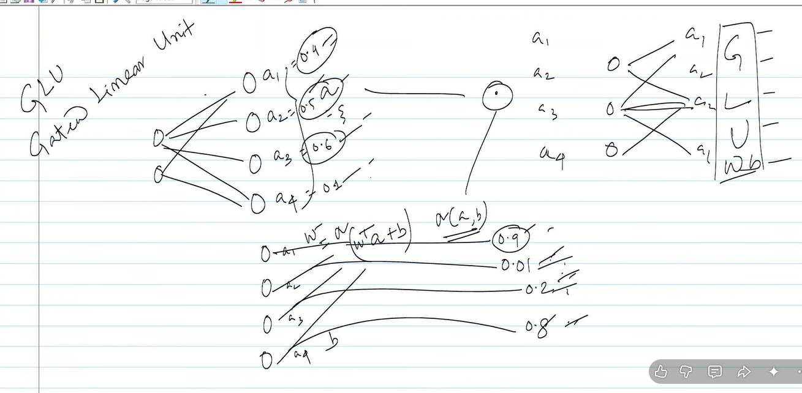

# GELU and GLU

Yes. The **GLU** your instructor has written is most likely **Gaussian Error Linear Unit (GELU)** — although the handwriting looks like “GLU.” The formula and the examples in the image point to **GELU**.

This is another activation function, following the discussion of ReLU, Leaky ReLU, PReLU, ELU, etc.

---

# 1. First: what problem are we trying to solve?

We already saw:

### ReLU

$$
f(x)=\max(0,x)
$$

It behaves like:

* positive (x) → keep it
* negative (x) → throw it away

For example:

$$
ReLU(-2)=0
$$

$$
ReLU(3)=3
$$

The problem is that ReLU makes a **hard decision at zero**.

Your instructor is now introducing a more gradual alternative.

---

# 2. What is GELU?

GELU stands for:

$$
\boxed{\text{Gaussian Error Linear Unit}}
$$

The original definition is:

$$
\boxed{GELU(x)=x\Phi(x)}
$$

where (\Phi(x)) is the **CDF of the standard normal distribution**.

In other words:

$$
\Phi(x)=P(Z\leq x),\qquad Z\sim N(0,1)
$$

So GELU is essentially:

$$
\boxed{\text{input}\times\text{probability-like gate}}
$$

This is the important intuition.

---

# 3. Compare it with ReLU

ReLU says:

$$
f(x)=
\begin{cases}
0 & x<0\
x & x\geq0
\end{cases}
$$

It is basically asking:

> "Is (x) positive?"

If yes → keep it.

If no → completely eliminate it.

GELU is softer.

It asks something more like:

> "How strongly should I keep this value?"

So instead of an abrupt:

$$
0\quad\longrightarrow\quad x
$$

GELU gives a **smooth transition**.

---

# 4. What does $(x\Phi(x))$ actually mean?

Let's take some examples.

For a standard normal distribution:

$$
\Phi(0)=0.5
$$

Therefore:

$$
GELU(0)=0(0.5)=0
$$

Now take a large positive number, say:

$$
x=3
$$

The normal CDF is approximately:

$$
\Phi(3)\approx0.999
$$

Therefore:

$$
GELU(3)\approx3(0.999)\approx3
$$

So for large positive values:

$$
\boxed{GELU(x)\approx x}
$$

Very similar to ReLU.

---

# 5. What happens for negative values?

This is where GELU becomes interesting.

Suppose:

$$
x=-1
$$

For the standard normal distribution:

$$
\Phi(-1)\approx0.159
$$

Therefore:

$$
GELU(-1)
=

-1(0.159)
$$

$$
\approx-0.159
$$

Notice:

$$
\boxed{GELU(-1)\neq0}
$$

Unlike ReLU:

$$
ReLU(-1)=0
$$

GELU keeps some negative information.

---

# 6. Compare ReLU and GELU

| $(x)$ | ReLU | GELU approximately |
| --: | ---: | -----------------: |
|  -2 |    0 |             -0.046 |
|  -1 |    0 |             -0.159 |
|   0 |    0 |                  0 |
|   1 |    1 |              0.841 |
|   2 |    2 |              1.954 |
|   3 |    3 |              2.996 |

The important pattern is:

### ReLU

$$
x<0\Rightarrow0
$$

### GELU

$$
x<0\Rightarrow\text{small negative value}
$$

and

$$
x>0\Rightarrow\text{mostly retain }x
$$

So GELU is **smooth**, whereas ReLU has a sharp corner at zero.

---

# 7. This explains the left side of your image

Your instructor has written something like:

$$
\text{GELU}
$$

and underneath:

$$
GELU(x)=x\Phi(x)
$$

Then there are examples such as:

$$
0.9,\quad0.01,\quad0.2,\quad0.8
$$

and arrows showing values being transformed.

The idea is that a layer has activations:

$$
a_1,a_2,a_3,a_4
$$

and the activation function transforms them:

$$
a_i\rightarrow GELU(a_i)
$$

So if the layer produces:

$$0.9,;0.01,;0.2,;0.8$$

GELU is applied element-by-element:

$$GELU(0.9),GELU(0.01),GELU(0.2),GELU(0.8)$$

It isn't combining those four neurons together. **Each value independently passes through GELU.**

---

# 8. Why is the Gaussian distribution involved?

This is probably the part that initially feels strange.

Why does an activation function suddenly involve a normal distribution?

Because:

$$
\Phi(x)
$$

acts like a **soft gate**.

Think about ReLU as:

$$
x\times I(x>0)
$$

where (I) is basically a hard yes/no decision:

$$
I(x>0)=
\begin{cases}
0 & x<0\
1 & x>0
\end{cases}
$$

GELU replaces this hard gate with:

$$
\Phi(x)
$$

which smoothly varies between 0 and 1.

So conceptually:

$$
\boxed{
ReLU \approx x\times\text{hard gate}
}
$$

whereas

$$
\boxed{
GELU=x\times\text{smooth probabilistic gate}
}
$$

That's a very useful intuition.

---

# 9. Why is GELU smoother than ReLU?

ReLU has:

$$
f(x)=0\quad x<0
$$

and

$$
f(x)=x\quad x>0
$$

At zero, it suddenly changes behavior.

GELU instead uses:

$$
\Phi(x)
$$

and the normal CDF changes smoothly.

Therefore:

$$
GELU(x)=x\Phi(x)
$$

is smooth.

This matters because neural networks are trained using gradients.

Smooth functions generally provide smoother gradient behavior.

---

# 10. There is an approximation you'll probably see

Calculating the normal CDF directly isn't always convenient.

So GELU is often approximated as:

$$
\boxed{
GELU(x)
\approx
\frac{x}{2}
\left[
1+\tanh
\left(
\sqrt{\frac{2}{\pi}}
\left(x+0.044715x^3\right)
\right)
\right]
}
$$

You don't need to memorize this immediately.

The important formula to remember conceptually is:

$$
\boxed{GELU(x)=x\Phi(x)}
$$

---

# 11. One very important distinction: GLU vs GELU

There is actually another neural-network concept called **GLU — Gated Linear Unit**.

So be careful with the handwriting.

### GELU

$$
\boxed{GELU(x)=x\Phi(x)}
$$

This is an **activation function**.

### GLU

A GLU generally involves two vectors:

$$
GLU(x)=A\otimes\sigma(B)
$$

where one part acts as a **gate** for another.

They are different things.

Given the formula visible in your image, your instructor appears to be discussing **GELU**, not GLU.

---

# 12. Why is GELU important today?

GELU became particularly important in **Transformer-based architectures**.

For example, the original BERT architecture uses GELU in its feed-forward network.

So when you eventually study:

$$
\text{Transformers}
\rightarrow
\text{BERT}
\rightarrow
\text{LLMs}
$$

you'll encounter GELU again.

This is why it is worth understanding rather than simply memorizing its formula.

---

# 13. Where this fits in your lecture sequence

You can now see the evolution your instructor is teaching:

$$
\boxed{\text{Linear}}
$$

↓

No nonlinearity → insufficient for deep representation.

↓

$$
\boxed{\text{Sigmoid}}
$$

↓

Saturation → vanishing gradients.

↓

$$
\boxed{\text{Tanh}}
$$

↓

Zero-centered, but still saturation/vanishing-gradient issues.

↓

$$
\boxed{\text{ReLU}}
$$

↓

Great positive-side gradient, but:

$$
\text{negative}\rightarrow0
$$

→ dying ReLU.

↓

$$
\boxed{\text{Leaky ReLU / PReLU / ELU}}
$$

↓

Improve negative side.

↓

$$
\boxed{\text{GELU}}
$$

↓

Smooth, non-zero treatment of negative inputs and soft gating.

---

## Short study notes

### GELU — Gaussian Error Linear Unit

$$
\boxed{GELU(x)=x\Phi(x)}
$$

where:

$$
\Phi(x)=\text{standard normal CDF}
$$

**Intuition:**

$$
\boxed{\text{GELU}=\text{input}\times\text{smooth gate}}
$$

Unlike ReLU:

$$
ReLU(x)=\max(0,x)
$$

GELU does **not abruptly eliminate all negative values**.

For large positive (x):

$$
GELU(x)\approx x
$$

For negative (x):

$$
GELU(x)<0
$$

but its magnitude is reduced.

**Key difference:**

$$
\boxed{
ReLU=\text{hard gating}
}
$$

$$
\boxed{
GELU=\text{smooth/probabilistic gating}
}
$$

And remember:

$$
\boxed{\text{GELU} \neq \text{GLU}}
$$

The formula in your image indicates **GELU**.
