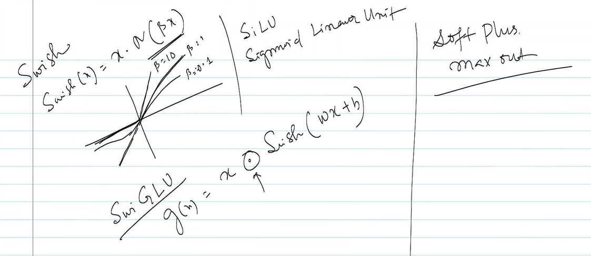

Yes. This page is continuing the same story, but now the instructor has moved into **smooth alternatives to ReLU**, especially **Swish/SiLU**, and then briefly mentions **Softplus** and **SwiGLU**.

The most important one on this page is **SiLU / Swish**.

---

# 1. First, look at the progression

So far you've seen:

$$
\text{Sigmoid}
\rightarrow
\text{Tanh}
\rightarrow
\text{ReLU}
\rightarrow
\text{Leaky ReLU}
\rightarrow
\text{PReLU}
\rightarrow
\text{ELU}
\rightarrow
\text{GELU}
$$

Now this page introduces:

$$
\boxed{\text{Swish / SiLU}}
$$

and

$$
\boxed{\text{Softplus}}
$$

and at the top-left:

$$
\boxed{\text{SwiGLU}}
$$

These are all related to the general idea:

> **Can we get the useful properties of ReLU while avoiding its sharp cutoff at zero?**

---

# 2. SiLU — Sigmoid Linear Unit

Your instructor writes approximately:

$$
g(x)=x\sigma(x)
$$

This is the **SiLU** activation function.

SiLU stands for:

$$
\boxed{\text{Sigmoid Linear Unit}}
$$

Since:

$$
\sigma(x)=\frac{1}{1+e^{-x}}
$$

we have:

$$
\boxed{
SiLU(x)=x\frac{1}{1+e^{-x}}
}
$$

This is also commonly called **Swish**.

---

# 3. Why does this formula make sense?

Look carefully:

$$
SiLU(x)=x\sigma(x)
$$

It is basically:

$$
\boxed{\text{input}\times\text{sigmoid gate}}
$$

Remember what sigmoid does:

$$
\sigma(x)\in(0,1)
$$

So sigmoid acts like a **soft gate**.

Instead of ReLU saying:

> "Negative? Throw it away."

SiLU says:

> "Negative? Reduce it according to how negative it is."

This is a very useful intuition.

---

# 4. Let's compare ReLU and SiLU

Suppose:

$$
x=-2
$$

ReLU:

$$
ReLU(-2)=0
$$

But:

$$
\sigma(-2)\approx0.119
$$

Therefore:

$$
SiLU(-2)=
-2(0.119)
$$

$$
\approx-0.238
$$

So SiLU **doesn't completely kill the negative value**.

---

For (x=2):

$$
\sigma(2)\approx0.881
$$

so:

$$
SiLU(2) = 
2(0.881)
$$

$$
\approx1.762
$$

For large positive (x):

$$
\sigma(x)\rightarrow1
$$

so:

$$
SiLU(x)\rightarrow x
$$

Therefore:

$$
\boxed{\text{SiLU behaves approximately like ReLU for large positive values}}
$$

but has a smooth negative region.

---

# 5. Compare the shapes

### ReLU

$$
ReLU(x)=\max(0,x)
$$

```text
       /
      /
     /
----●-------- x
```

Sharp corner at zero.

---

### SiLU

$$
SiLU(x)=x\sigma(x)
$$

It looks more like a smooth curve:

```text
             /
           _/
        __/
------_/---------- x
     /
   _/
```

There is **no sudden hard cutoff** at zero.

That's one of its major characteristics.

---

# 6. Why is SiLU interesting for gradients?

This connects directly to your earlier lecture.

ReLU:

$$
ReLU'(x)=0\quad\text{for }x<0
$$

So negative neurons can have zero gradient.

SiLU is smooth, and its derivative is:

$$
\boxed{
SiLU'(x)=\sigma(x)+x\sigma(x)(1-\sigma(x))
}
$$

So unlike ReLU, the derivative changes smoothly around zero.

This can make optimization behave more smoothly.

---

# 7. Swish

Your instructor has written:

$$
\boxed{f(x)=x\sigma(\beta x)}
$$

This is **Swish**.

Notice that SiLU is essentially the special case:

$$
\beta=1
$$

So:

$$
\boxed{SiLU(x)=x\sigma(x)}
$$

while the more general Swish is:

$$
\boxed{Swish(x)=x\sigma(\beta x)}
$$

The parameter (\beta) controls how sharply the sigmoid gate changes.

---

# 8. What does (\beta) do?

Imagine:

$$
f(x)=x\sigma(\beta x)
$$

If (\beta) is large, the sigmoid changes more sharply around zero.

If (\beta) is smaller, the transition becomes more gradual.

So (\beta) controls the shape of the gating.

This is why the instructor has several curves coming out from the origin in the drawing — they're showing different values of (\beta).

---

# 9. Softplus

On the right your instructor has written:

$$
\boxed{\text{Softplus}}
$$

and something like:

$$
\max x\quad\text{out}
$$

The actual Softplus function is:

$$
\boxed{
Softplus(x)=\ln(1+e^x)
}
$$

Softplus is basically a **smooth approximation of ReLU**.

Compare:

$$
ReLU(x)=\max(0,x)
$$

with:

$$
Softplus(x)=\ln(1+e^x)
$$

For large positive (x):

$$
Softplus(x)\approx x
$$

For large negative (x):

$$
Softplus(x)\approx0
$$

So it has the same general shape as ReLU, but without the sharp corner.

---

# 10. A beautiful connection: Softplus → ReLU

Consider:

$$
Softplus(x)=\ln(1+e^x)
$$

### If (x) is very positive:

$$
e^x\gg1
$$

so:

$$
\ln(1+e^x)\approx\ln(e^x)=x
$$

Therefore:

$$
Softplus(x)\approx x
$$

### If (x) is very negative:

$$
e^x\approx0
$$

so:

$$
Softplus(x)\approx\ln(1)=0
$$

Therefore:

$$
\boxed{Softplus(x)\approx ReLU(x)}
$$

but smoothly.

---

# 11. There is an especially nice derivative

Softplus has:

$$
\boxed{
\frac{d}{dx}Softplus(x)=\sigma(x)
}
$$

That's a beautiful connection:

$$
Softplus(x)=\ln(1+e^x)
$$

and its derivative is:

$$
\sigma(x)
$$

So:

$$
\boxed{
\text{Softplus is a smooth ReLU}
}
$$

and:

$$
\boxed{
\text{Sigmoid is the derivative of Softplus}
}
$$

This is worth remembering.

---

# 12. Now the interesting one: SwiGLU

At the top-left your instructor writes:

$$
\boxed{\text{SwiGLU}}
$$

This is slightly different from the other functions we've been discussing.

It's not simply an activation function applied to one number.

It is a **gated activation structure** used in neural-network feed-forward layers, particularly in modern Transformer architectures.

The name comes from:

$$
\boxed{\text{Swish}+\text{GLU}}
$$

A simplified form is:

$$
\boxed{
SwiGLU(x)=
Swish(xW_g)
\odot
(xW_v)
}
$$

where:

* (W_g) creates a **gate**
* (W_v) creates the **value**
* (Swish/SiLU) is applied to the gate
* (\odot) means element-wise multiplication

Conceptually:

$$
x
\rightarrow
\begin{cases}
\text{gate}\
\text{value}
\end{cases}
$$

then:

$$
\boxed{
\text{output} =
\text{gate}\times\text{value}
}
$$

This is more sophisticated than simply:

$$
y=f(x)
$$

---

# 13. Why gating?

Think of a gate as saying:

> **"How much of this information should be allowed through?"**

Suppose we have:

$$
\text{value}=10
$$

and the gate produces:

$$
0.8
$$

Then:

$$
10\times0.8=8
$$

If the gate produces:

$$
0.1
$$

then:

$$
10\times0.1=1
$$

So the network learns to **control information flow**.

This idea becomes extremely important when you study Transformers and LLM architectures.

---

# 14. One important distinction

Don't mix these three:

### SiLU

$$
\boxed{SiLU(x)=x\sigma(x)}
$$

Single-input activation.

### Swish

$$
\boxed{Swish(x)=x\sigma(\beta x)}
$$

Generalized version; SiLU corresponds to (\beta=1).

### SwiGLU

A **gated feed-forward mechanism**, roughly:

$$
\boxed{
SwiGLU(x)=Swish(xW_g)\odot(xW_v)
}
$$

So SwiGLU is **not merely another scalar activation function like ReLU**.

---

# 15. Where does this fit into everything you've learned?

Your instructor is gradually moving toward modern neural networks.

You started with:

### Linear

$$
f(x)=x
$$

Problem:

$$
\text{no nonlinearity}
$$

↓

### Sigmoid

$$
f(x)=\sigma(x)
$$

Problem:

$$
\text{vanishing gradients}
$$

↓

### Tanh

$$
f(x)=\tanh(x)
$$

Better centered, but still saturation.

↓

### ReLU

$$
f(x)=\max(0,x)
$$

Problem:

$$
\text{dying ReLU}
$$

↓

### Leaky ReLU / PReLU / ELU

Try to improve the negative region.

↓

### GELU

$$
f(x)=x\Phi(x)
$$

Smooth gating.

↓

### SiLU / Swish

$$
f(x)=x\sigma(\beta x)
$$

Smooth sigmoid-based gating.

↓

### SwiGLU

Use **learned gates + values** inside a neural-network block.

---

# Short study notes

### SiLU

$$
\boxed{SiLU(x)=x\sigma(x)}
$$

where:

$$
\sigma(x)=\frac{1}{1+e^{-x}}
$$

* Smooth activation.
* Similar to ReLU for large positive (x).
* Doesn't completely eliminate negative inputs.
* Derivative:

$$
SiLU'(x)=\sigma(x)+x\sigma(x)(1-\sigma(x))
$$

---

### Swish

$$
\boxed{Swish(x)=x\sigma(\beta x)}
$$

* Generalized SiLU.
* (\beta) controls the shape.
* SiLU is essentially Swish with (\beta=1).

---

### Softplus

$$
\boxed{Softplus(x)=\ln(1+e^x)}
$$

* Smooth approximation of ReLU.
* For large (x), behaves approximately like (x).
* For very negative (x), approaches (0).

And:

$$
\boxed{Softplus'(x)=\sigma(x)}
$$

---

### SwiGLU

Roughly:

$$
\boxed{
SwiGLU(x)=Swish(xW_g)\odot(xW_v)
}
$$

* Uses a **gate** to control a **value**.
* Important in modern Transformer/LLM architectures.
* Not simply a scalar activation like ReLU.

---

### The key idea behind this whole page

The instructor is essentially moving from **hard activation** to **smooth activation** to **learned gating**:

$$
\boxed{
ReLU
\rightarrow
GELU
\rightarrow
SiLU/Swish
\rightarrow
SwiGLU
}
$$

And the underlying question remains the same:

> **How can we introduce nonlinearity while allowing useful information and gradients to flow through a deep neural network?**
