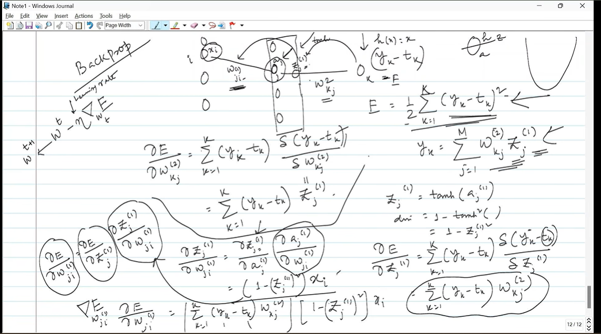

Yes — this is the **most important mathematical step after the forward pass**.

In the previous pages, the instructor taught you:

1. What an MLP is.
2. How a neuron computes its output.
3. What activation functions do.
4. How to calculate the network's prediction.

Now the question becomes:

> **The network produced an answer, but how do we figure out which weights are responsible for the error, and how should we change those weights?**

That is **backpropagation**.

And your instructor is deriving exactly that.

---

# 1. Start from the problem we already know

Suppose the network receives an input:

$$
x
$$

and produces:

$$
y
$$

But we also know the correct answer:

$$
t
$$

where (t) is the **target**.

For example:

$$
t=1
$$

but the network predicts:

$$
y=0.7
$$

So the network made an error.

We need some numerical measure of how bad that prediction was.

---

# 2. Define the error / loss

Your instructor writes:

$$
\boxed{
E=\frac12\sum_{k=1}^{K}(y_k-t_k)^2
}
$$

This is the **squared error**.

For one output:

$$
E=\frac12(y-t)^2
$$

Why the (\frac12)?

Purely for mathematical convenience. When we differentiate the square, the 2 cancels:

$$
\frac{\partial}{\partial y}
\left[\frac12(y-t)^2\right] =
y-t
$$

So the loss tells us:

> **How far is the network's prediction from the target?**

---

# 3. The ultimate goal

We want to change the weights so that:

$$
E\downarrow
$$

Therefore, for every weight (w), we want to know:

$$
\boxed{\frac{\partial E}{\partial w}}
$$

This is the key quantity.

It tells us:

> **If I change this particular weight slightly, what happens to the error?**

That is the fundamental idea behind gradient-based learning.

---

# 4. Let's look at the network in your image

The instructor is considering something like:

$$
x_i
\rightarrow
\text{hidden neuron }j
\rightarrow
\text{output neuron }k
$$

The first-layer weight is:

$$
w_{ji}^{(1)}
$$

and the second-layer weight is:

$$
w_{kj}^{(2)}
$$

The network works forward:

$$
x_i
\rightarrow
a_j^{(1)}
\rightarrow
z_j^{(1)}
\rightarrow
y_k
$$

But when learning, we go **backward**:

$$
E
\rightarrow
y_k
\rightarrow
z_j^{(1)}
\rightarrow
w_{ji}^{(1)}
$$

That's why it is called:

$$
\boxed{\text{backpropagation}}
$$

---

# 5. The central mathematical trick: chain rule

This is the single most important thing happening on this page.

Suppose we want:

$$
\frac{\partial E}{\partial w_{ji}^{(1)}}
$$

The error (E) doesn't depend directly on that weight.

There are several intermediate quantities between them.

So we use the **chain rule**:

$$
\boxed{
\frac{\partial E}{\partial w_{ji}^{(1)}} = 

\frac{\partial E}{\partial y_k}
\frac{\partial y_k}{\partial z_j^{(1)}}
\frac{\partial z_j^{(1)}}{\partial a_j^{(1)}}
\frac{\partial a_j^{(1)}}{\partial w_{ji}^{(1)}}
}
$$

That's basically what all those circles and arrows in your professor's notes are showing.

The professor is saying:

> "I can't differentiate the error with respect to this weight in one step, so I'll break the journey into smaller steps."

---

# 6. Let's derive it slowly

This will make the whole page much easier.

We have:

$$
E=\frac12\sum_k(y_k-t_k)^2
$$

Let's focus on one output (k).

---

## Step 1: derivative of error with respect to output

$$
E=\frac12(y_k-t_k)^2
$$

Therefore:

$$
\boxed{
\frac{\partial E}{\partial y_k}=y_k-t_k
}
$$

This is the first term in your professor's derivation.

It basically tells us:

> Is the prediction too high or too low?

If:

$$
y_k-t_k>0
$$

the prediction is too high.

If:

$$
y_k-t_k<0
$$

the prediction is too low.

---

# 7. Now how does (y_k) depend on the second-layer weight?

Your earlier forward-pass equation was:

$$
\boxed{
y_k=\sum_j w_{kj}^{(2)}z_j^{(1)}
}
$$

Therefore:

$$
\frac{\partial y_k}{\partial w_{kj}^{(2)}} = 

z_j^{(1)}
$$

So using the chain rule:

$$
\frac{\partial E}{\partial w_{kj}^{(2)}} = 
\frac{\partial E}{\partial y_k}
\frac{\partial y_k}{\partial w_{kj}^{(2)}}
$$

Therefore:

$$
\boxed{
\frac{\partial E}{\partial w_{kj}^{(2)}} = 
(y_k-t_k)z_j^{(1)}
}
$$

This is one of the important results your instructor is deriving.

---

# 8. What does this equation mean intuitively?

$$
\frac{\partial E}{\partial w_{kj}^{(2)}} = 
(y_k-t_k)z_j^{(1)}
$$

There are two factors:

### Error:

$$
(y_k-t_k)
$$

and

### Activation coming into the weight:

$$
z_j^{(1)}
$$

So:

> **A weight gets a large gradient when the network's error is large and the neuron feeding that weight is strongly activated.**

That's a very useful intuition.

---

# 9. Now the harder part: the weight in the first layer

The professor is also deriving:

$$
\frac{\partial E}{\partial w_{ji}^{(1)}}
$$

This is harder because that weight is **farther away from the error**.

Look at the path:

$$
w_{ji}^{(1)}
\rightarrow
a_j^{(1)}
\rightarrow
z_j^{(1)}
\rightarrow
y_k
\rightarrow
E
$$

So the chain rule gives:

$$
\boxed{
\frac{\partial E}{\partial w_{ji}^{(1)}} = 
\frac{\partial E}{\partial y_k}
\frac{\partial y_k}{\partial z_j^{(1)}}
\frac{\partial z_j^{(1)}}{\partial a_j^{(1)}}
\frac{\partial a_j^{(1)}}{\partial w_{ji}^{(1)}}
}
$$

Now let's calculate each piece.

---

# 10. First piece

We already know:

$$
\frac{\partial E}{\partial y_k} = 
y_k-t_k
$$

---

# 11. Second piece

We have:

$$
y_k=\sum_jw_{kj}^{(2)}z_j^{(1)}
$$

Therefore:

$$
\boxed{
\frac{\partial y_k}{\partial z_j^{(1)}}=w_{kj}^{(2)}
}
$$

So the second-layer weight appears in the gradient.

This makes intuitive sense.

The hidden neuron affects the output through the connection:

$$
w_{kj}^{(2)}
$$

---

# 12. Third piece: activation function

Your instructor has chosen:

$$
\boxed{
z_j^{(1)}=\tanh(a_j^{(1)})
}
$$

Therefore:

$$
\frac{\partial z_j^{(1)}}{\partial a_j^{(1)}} = 
\tanh'(a_j^{(1)})
$$

And we learned earlier:

$$
\tanh'(x)=1-\tanh^2(x)
$$

Since:

$$
z_j^{(1)}=\tanh(a_j^{(1)})
$$

we can write:

$$
\boxed{
\frac{\partial z_j^{(1)}}{\partial a_j^{(1)}} = 
1-(z_j^{(1)})^2
}
$$

This is exactly what you can see on the lower-right side of your image.

---

# 13. Fourth piece

The first hidden neuron calculates:

$$
a_j^{(1)} = 
\sum_iw_{ji}^{(1)}x_i+b_j^{(1)}
$$

Therefore:

$$
\boxed{
\frac{\partial a_j^{(1)}}{\partial w_{ji}^{(1)}}=x_i
}
$$

Because the weight appears as:

$$
w_{ji}^{(1)}x_i
$$

and the derivative with respect to the weight is simply:

$$
x_i
$$

---

# 14. Put all four pieces together

Now:

$$
\frac{\partial E}{\partial w_{ji}^{(1)}} = 
\frac{\partial E}{\partial y_k}
\frac{\partial y_k}{\partial z_j^{(1)}}
\frac{\partial z_j^{(1)}}{\partial a_j^{(1)}}
\frac{\partial a_j^{(1)}}{\partial w_{ji}^{(1)}}
$$

Substitute:


$$
(y_k-t_k)
(w_{kj}^{(2)})
(1-(z_j^{(1)})^2)
x_i
$$

Therefore:

$$
\boxed{
\frac{\partial E}{\partial w_{ji}^{(1)}} = 
\sum_{k=1}^{K}
(y_k-t_k)
w_{kj}^{(2)}
\left[1-(z_j^{(1)})^2\right]
x_i
}
$$

That is essentially the big equation at the bottom of your instructor's page.

---

# 15. Why is there a summation over (k)?

This is important.

One hidden neuron can connect to **multiple output neurons**.

For example:

```text
              output 1
             /
hidden j ---<
             \
              output 2
```

The hidden neuron (j) influences **all** those outputs.

Therefore, its contribution to the total error comes through all output neurons:

$$
k=1,\ldots,K
$$

So we sum their contributions:

$$
\sum_{k=1}^{K}
$$

That's why your instructor has:

$$
\sum_{k=1}^{K}
(y_k-t_k)w_{kj}^{(2)}
$$

in the equation.

---

# 16. This is the essence of backpropagation

Look at what happened.

We started from:

$$
E
$$

and moved backward:

$$
\boxed{
E
\rightarrow
y
\rightarrow
z^{(1)}
\rightarrow
a^{(1)}
\rightarrow
w^{(1)}
}
$$

At every step, we calculated a derivative.

And multiplied them:

$$
\boxed{\text{chain rule}}
$$

That's literally backpropagation.

---

# 17. Why "backpropagation"?

Because we're propagating the **error gradient** backward through the network.

Forward:

$$
x
\rightarrow
\text{hidden layer}
\rightarrow
\text{output}
\rightarrow
E
$$

Backward:

$$
E
\rightarrow
\text{output layer}
\rightarrow
\text{hidden layer}
\rightarrow
\text{earlier layers}
$$

Notice the distinction:

### Forward propagation

Propagates **activations/data** forward.

### Backpropagation

Propagates **gradients/error information** backward.

---

# 18. But what do we actually do with the gradient?

This is the next critical step.

Once we know:

$$
\frac{\partial E}{\partial w}
$$

we update the weight using gradient descent:

$$
\boxed{
w_{\text{new}} = 
w_{\text{old}}
\eta
\frac{\partial E}{\partial w}
}
$$

where:

$$
\eta
$$

is the **learning rate**.

Why the minus sign?

Because the gradient points in the direction of **increasing** error.

We want to move in the opposite direction.

So:

$$
\boxed{\text{gradient descent}=\text{move opposite to gradient}}
$$

---

# 19. This connects everything you've learned so far

You can now see the entire training process.

## Step 1 — Give input

$$
x
$$

↓

## Step 2 — Forward propagation

Calculate:

$$
a^{(1)}
$$

then:

$$
z^{(1)}=h(a^{(1)})
$$

then:

$$
y
$$

↓

## Step 3 — Calculate loss

$$
E=\frac12\sum_k(y_k-t_k)^2
$$

↓

## Step 4 — Backpropagation

Calculate:

$$
\frac{\partial E}{\partial w}
$$

for every weight.

↓

## Step 5 — Gradient descent

Update:

$$
w\leftarrow
w-\eta\frac{\partial E}{\partial w}
$$

↓

## Step 6

Repeat for many training examples.

Eventually:

$$
\boxed{E\rightarrow\text{small}}
$$

---

# 20. And NOW the earlier activation-function lecture makes much more sense

Remember when your instructor was talking about:

* sigmoid
* tanh
* ReLU
* vanishing gradients
* GELU
* SiLU

At the time it may have seemed like:

> "Why are we spending so much time on these functions?"

Now you can see why.

Look at the backpropagation equation:

$$
\frac{\partial E}{\partial w_{ji}^{(1)}} = 
\sum_k
(y_k-t_k)
w_{kj}^{(2)}
\underbrace{\left[1-(z_j^{(1)})^2\right]}_{\text{activation derivative}}
x_i
$$

That activation derivative is **inside the gradient calculation**.

So if your activation function has a tiny derivative:

$$
g'(a)\approx0
$$

then:

$$
\frac{\partial E}{\partial w}
\approx0
$$

and the weight barely updates.

**That's the mathematical reason behind the vanishing-gradient problem you were learning earlier.**

Everything is connecting now.

---

# 21. A simple mental model

Think of a neural network as a company.

The final output is wrong.

The CEO says:

> "We made a mistake. Figure out which decisions contributed to it."

Backpropagation goes backward:

**Output**

> "My prediction was too high."

↓

**Previous layer**

> "Okay, how much did my output contribute to that?"

↓

**Previous layer**

> "And how much did my inputs/weights contribute to my output?"

↓

Eventually every weight gets a number:

$$
\frac{\partial E}{\partial w}
$$

That number tells us:

> **"How responsible is this weight for the current error, and in which direction should we change it?"**

Then gradient descent adjusts every weight.

---

# 22. What your instructor is specifically teaching on this page

The page isn't just saying "backpropagation = chain rule."

They're actually **deriving the gradient mathematically**.

The instructor is showing:

### Output-layer weight

$$
\boxed{
\frac{\partial E}{\partial w_{kj}^{(2)}} = 
(y_k-t_k)z_j^{(1)}
}
$$

and then going further backward to:

### First-layer weight

$$
\boxed{
\frac{\partial E}{\partial w_{ji}^{(1)}} = 
\sum_k
(y_k-t_k)
w_{kj}^{(2)}
\left[1-(z_j^{(1)})^2\right]
x_i
}
$$

using:

$$
z_j^{(1)}=\tanh(a_j^{(1)})
$$

and:

$$
\tanh'(a)=1-\tanh^2(a)
$$

So the instructor wants you to understand **where the gradient formula comes from**, rather than memorize it.

---

# 23. The most important thing to take away

Don't try to memorize that giant equation yet.

Understand this structure:

$$
\boxed{
\frac{\partial E}{\partial w} =
\text{error}
\times
\text{downstream weights}
\times
\text{activation derivative}
\times
\text{input}
}
$$

And fundamentally:

$$
\boxed{
\text{Backpropagation} = 
\text{Chain Rule applied backward through the network}
}
$$

Then:

$$
\boxed{
\text{Gradient}
\rightarrow
\text{Gradient Descent}
\rightarrow
\text{Weight Update}
}
$$

That's the core of how an MLP **learns**.

---

## Short study notes

### Backpropagation

**Purpose:** Calculate how much each weight contributes to the loss.

1. **Forward pass**

$$
a^{(l)}=W^{(l)}z^{(l-1)}+b^{(l)}
$$

$$
z^{(l)}=h(a^{(l)})
$$

2. **Calculate loss**

$$
E=\frac12\sum_k(y_k-t_k)^2
$$

3. **Backward pass**

Use the chain rule:

$$
\boxed{
\frac{\partial E}{\partial w} = 
\frac{\partial E}{\partial(\text{output})}
\frac{\partial(\text{output})}{\partial(\text{previous})}
\cdots
\frac{\partial(\text{previous})}{\partial w}
}
$$

For the output weight:

$$
\boxed{
\frac{\partial E}{\partial w_{kj}^{(2)}} = 
(y_k-t_k)z_j^{(1)}
}
$$

For the first-layer weight with tanh:

$$
\boxed{
\frac{\partial E}{\partial w_{ji}^{(1)}} = 
\sum_k
(y_k-t_k)
w_{kj}^{(2)}
\left[1-(z_j^{(1)})^2\right]
x_i
}
$$

4. **Update weights**

$$
\boxed{
w\leftarrow w-\eta\frac{\partial E}{\partial w}
}
$$

### One sentence to remember

> **Forward propagation calculates the prediction; backpropagation calculates how each weight should change; gradient descent actually changes the weights.**

And the beautiful connection to your previous lecture is:

$$
\boxed{
\text{Activation derivative}
\rightarrow
\text{gradient flow}
\rightarrow
\text{learning}
}
$$

So now you're essentially at the point where the whole basic MLP training mechanism has come together.
