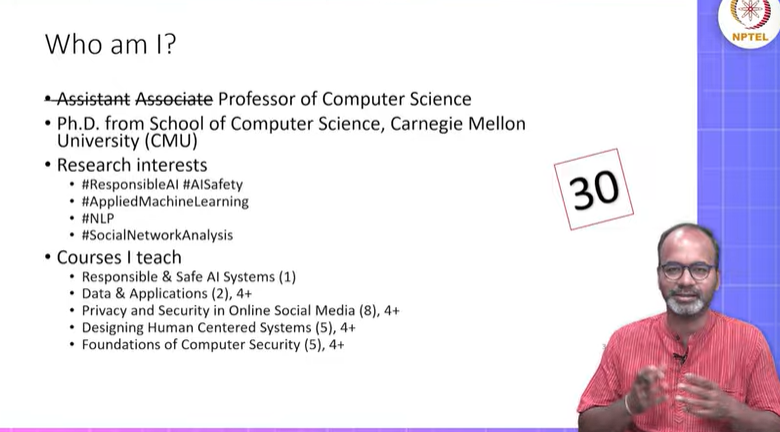
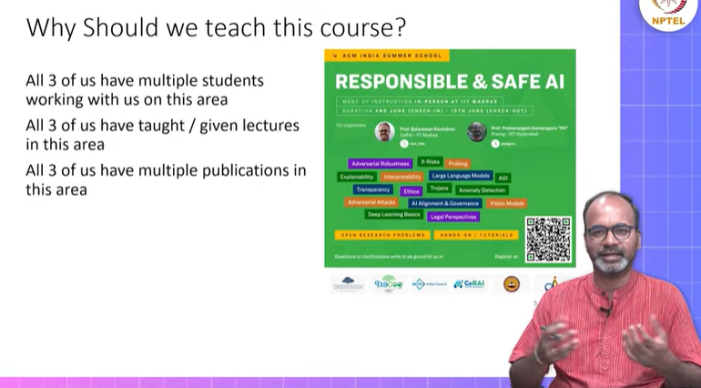
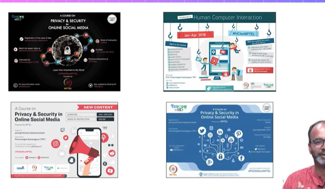
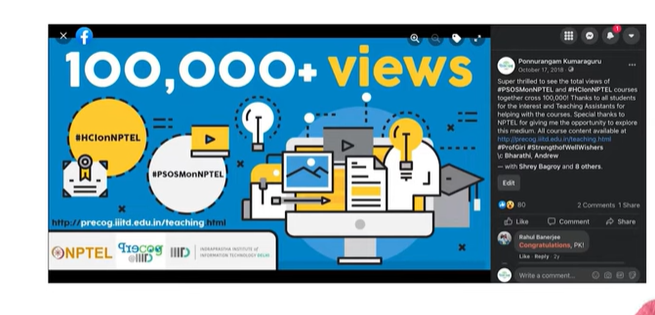
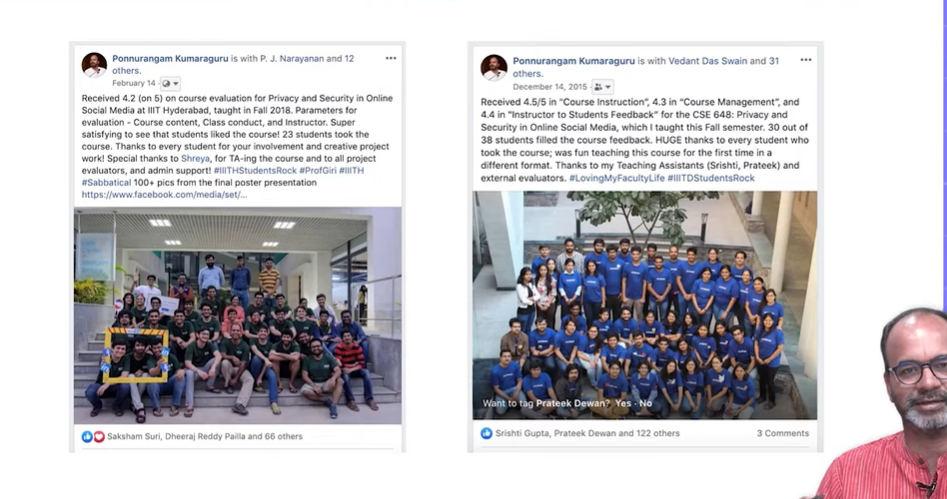

# Introduction

* **Who am I?**

## Why should we teach this course?

* Why Should I teach this course?
    * Taught a full semester 4 credits course on RAI at IIITH

## Post Conditions

* Students will **recognize possible harms** that can be caused by modern
Al capabilities
* Students will learn to **reason** about various perspectives on the
trajectory of Al development and proliferation
* Students will learn about **latest research agendas** towards making Al systems safer

## Pedagogy

* Learning
  * Lectures
  * Reading/Participating in research papers discussion
  * Online discussion : Mailing list
* Learning by doing
  * Highly recommend taking up some ideas during the semester and trying it out Some of the best students can come and work with me later / internship / project

## Topics to cover

Al Capabilities  
Al Risks / X-Risks  
Robustness / Interpretability / Inconsistency / Transparency  
Alignment  
Privacy / Fairness in Al  
Bias / Stereotype  
RAI in Domains (Healthcare, Education, Legal)
Panel discussion / Fireside chat / Paper reading   