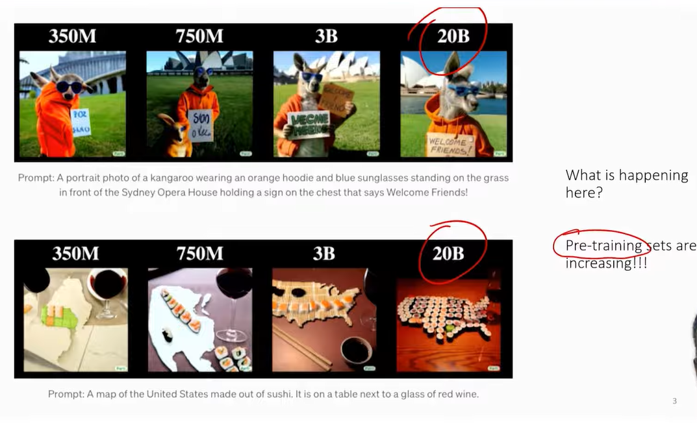
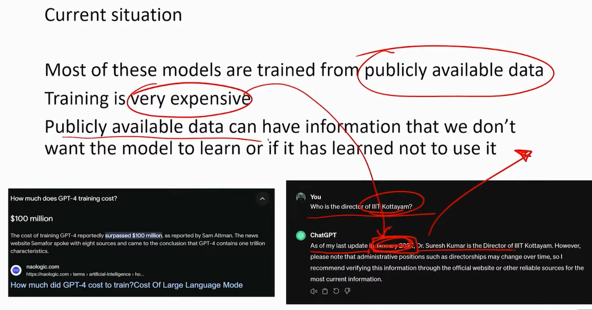

# Lecture 17 - Machine and Graph - Unlearning

```txt
Welcome back. Welcome back to the course, responsible and safe AI. Hope you're enjoying the course. What we're going to see in this part of the course is - 
Machine and graph and unlearning.

So this is this becoming a very, very important topic. You'll realize why it is important, all that in this module.

But hopefully you're also participating in the mailing list, And please do ask us any questions.
Join the live session, 
do the hands on sessions. 
I think some of these Modules also will start having Hands on sessions as we move Which is a separate video that you will have where we are walking you through some code collab kaggle. 
All of this we will actually go through with some data sets, do some analysis, see what is going on and all of that I highly, highly request you to do it yourself. 
The the reason that you want to do it also is that it will be part of the exam, it will be part of the weekly assignments.

After required content for the Class we have also kept a content that is supplement to the course,
which is there is a lot of ML basics, Transformers, Encoders decoders. It help you to connect with the course. 
```

* Increase in Parameters e.g. 350M to 20B



### Current Situation

