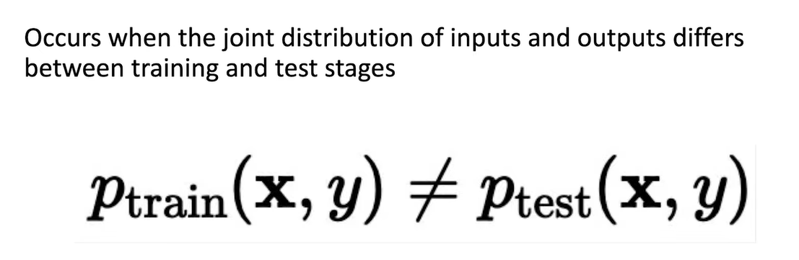
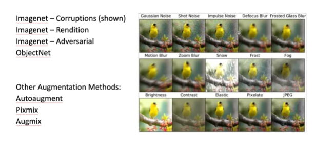
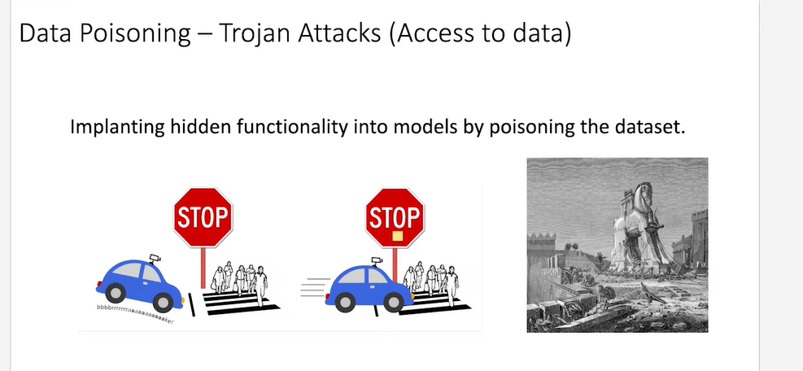
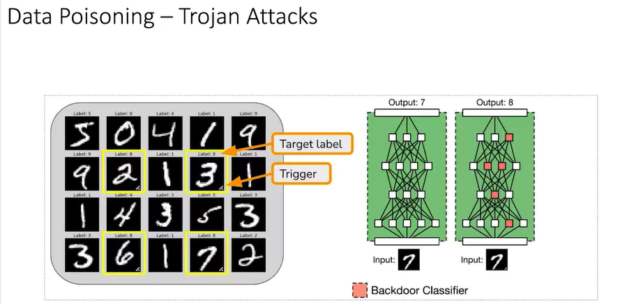

# Robustness

The ability of Al systems to maintain
optimal performance and reliability under a
wide range of conditions.

The goal is to build systems that perform
well even in the presence of:
Noisy data
- Unforeseen extreme events
- Adversarial attackers

## Distribution Shifts



Example - 


## Stress-Testing : ImageNet variants



## Code demo in jupyter notebook

## Data Poisoning - Trojan Attacks (Access to data)



> Giving a yellow square and telling not to stop



# How to start


### 1. Open Anaconda Prompt

From Windows Start, open **Anaconda Prompt (Anaconda3)**.

### 2. Go to your Jupyter folder

Run:

```text
cd /d D:\Jupyter
```

You should see:

```text
(base) D:\Jupyter>
```

### 3. Start Jupyter

Run:

```text
jupyter notebook
```

Your browser will open Jupyter at `localhost:8888`.

### 4. Open your notebook

You'll see:

**`Robustness_Hands_On.ipynb`**

Double-click it.

### 5. Check the kernel

At the top-right, make sure it says:

**Python (PyTorch)**

If it does, you're ready.

### 6. Continue from where you stopped

Your notebook has already saved the previous cells and the Fashion-MNIST dataset is now downloaded.

So **don't rerun everything unnecessarily**. Just scroll to the next cell after the dataset setup and continue.

---

### Your mental model for next time

```text
Windows
  ↓
Anaconda Prompt
  ↓
cd /d D:\Jupyter
  ↓
jupyter notebook
  ↓
Robustness_Hands_On.ipynb
  ↓
Python (PyTorch)
  ↓
Continue learning
```

And importantly, **you do NOT need to run `conda activate pytorch` before starting Jupyter** in your current setup. The Jupyter server is in the base environment, while `Python (PyTorch)` is the kernel that provides PyTorch.
