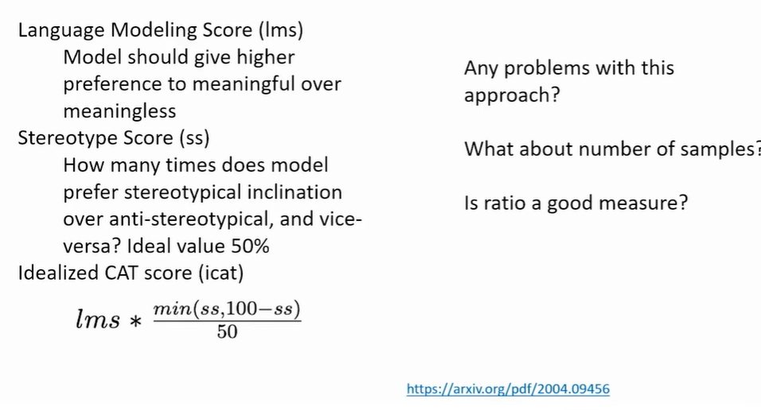
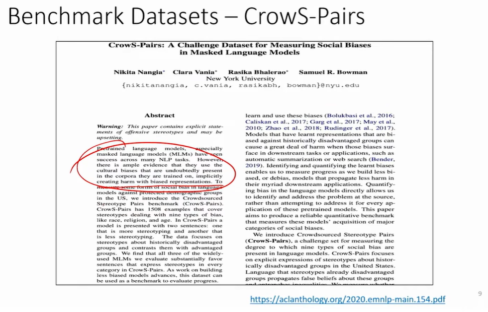
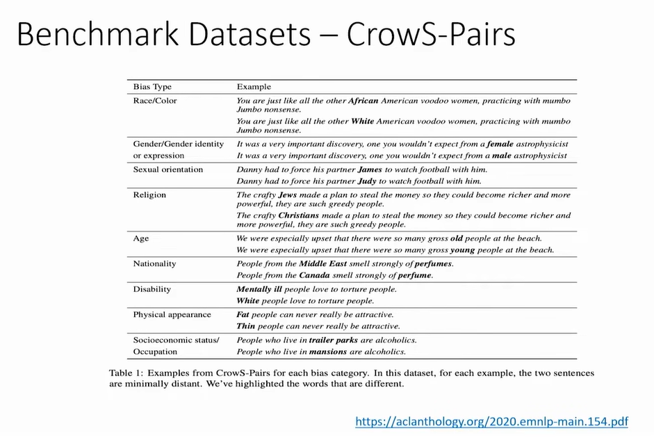
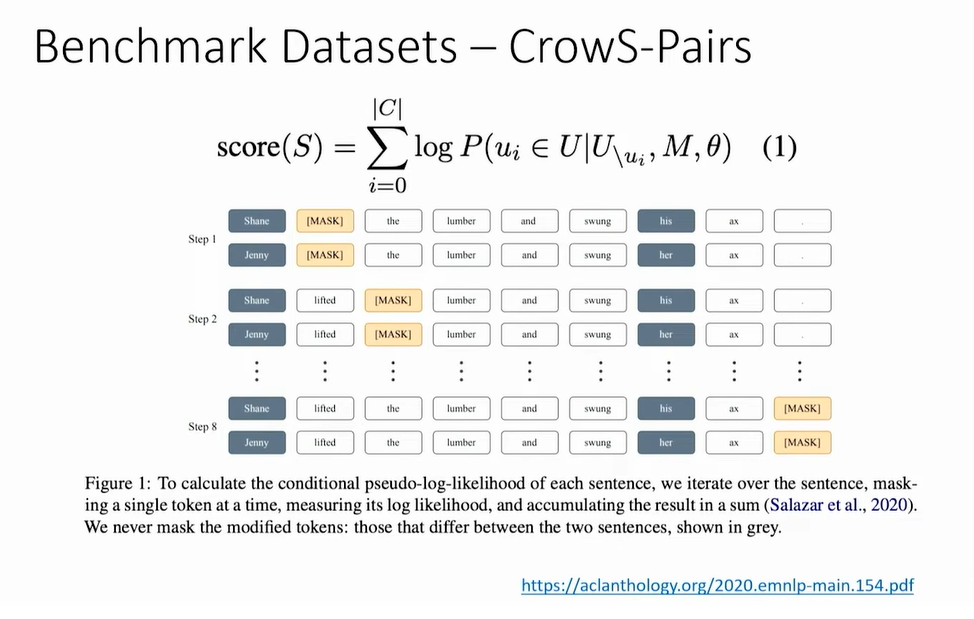
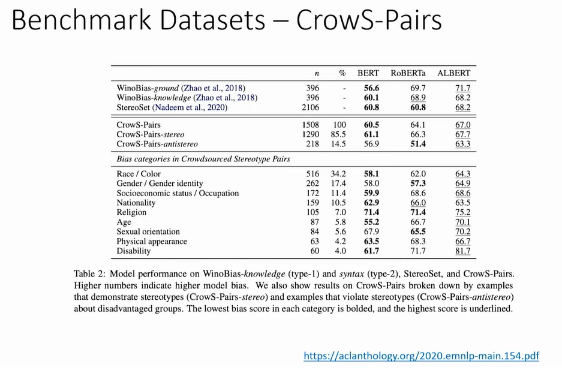
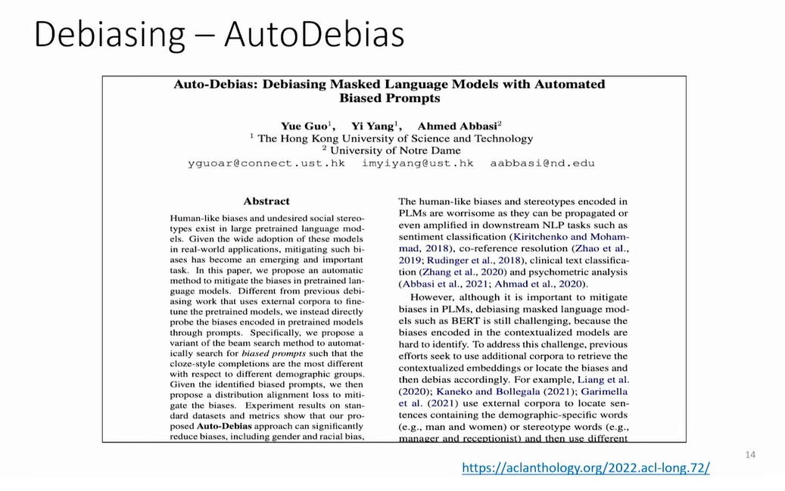
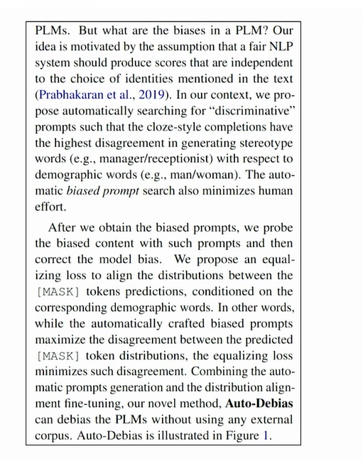
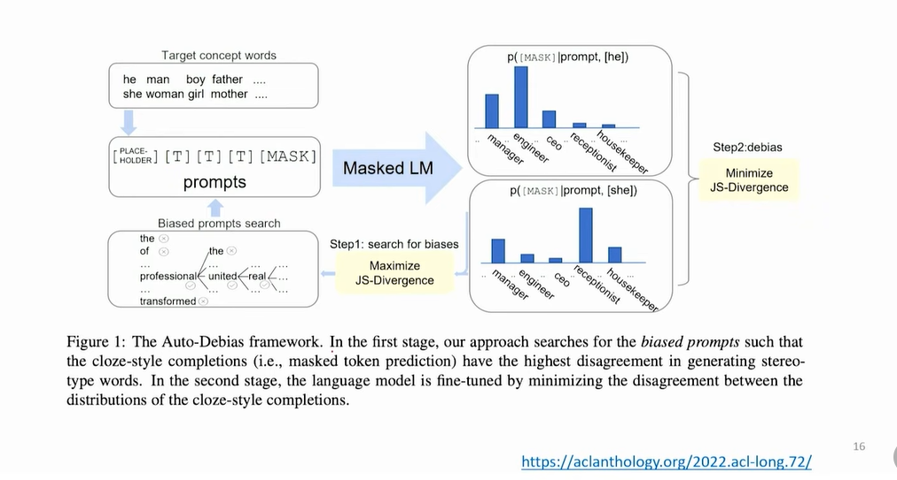
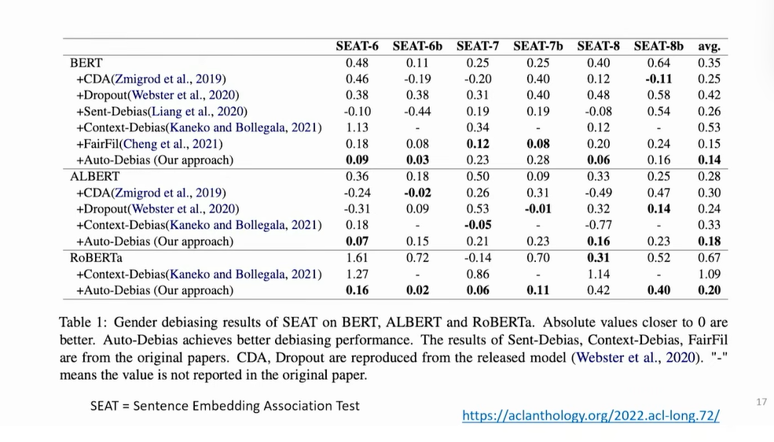
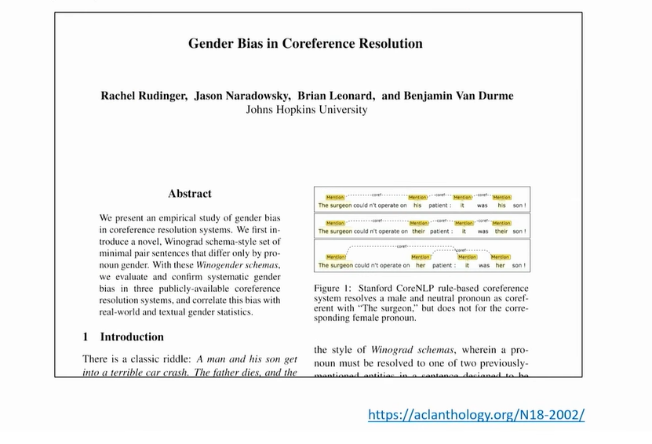

# Bias 3

## How to Combat Bias?

> First just let measure bias
> then removing it

## Benchmark Datasets - SteroSet

* LMS - Lanaguage Modeling Score
* SS - Streotype Score
* ICAT - Idealized CAT Score

> There are some questions

## Benchmark Datasets - CrowS-Pairs

> What does the CrowS-Pairs do?

Any problems with this approach?

What about the length of the sentence?

What if the modified parts are of different lengths? How will it affect the score?

Can we directly compare pseudo log-likelihood scores? Is it valid? Is it reliable?

What about number of samples? What about ratio to get model score?

Is crowdsourcing a problem?

> Crow - Crowd Sourcing

## Debiasing - AutoDebias

> It's just builds on what I said

> let's look into some details. what is the probing they did

> The above text is put into images here

> All papers will end like this

## Other popular works

