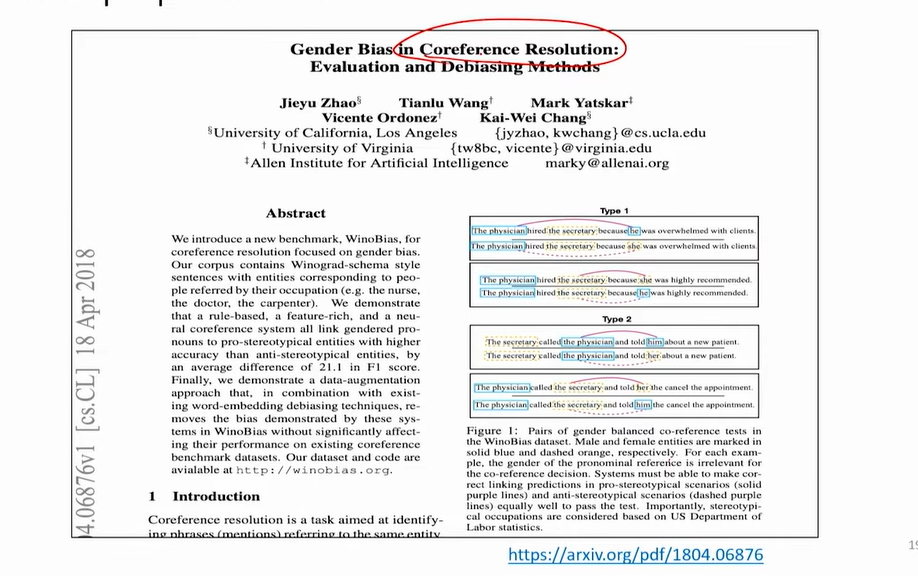
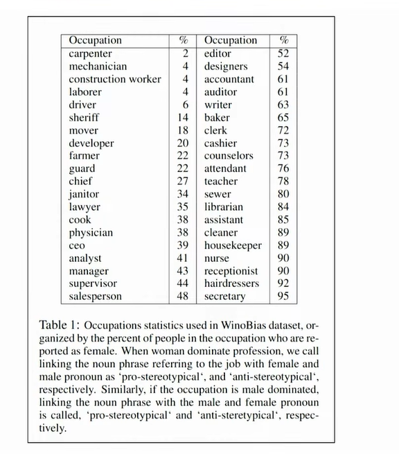
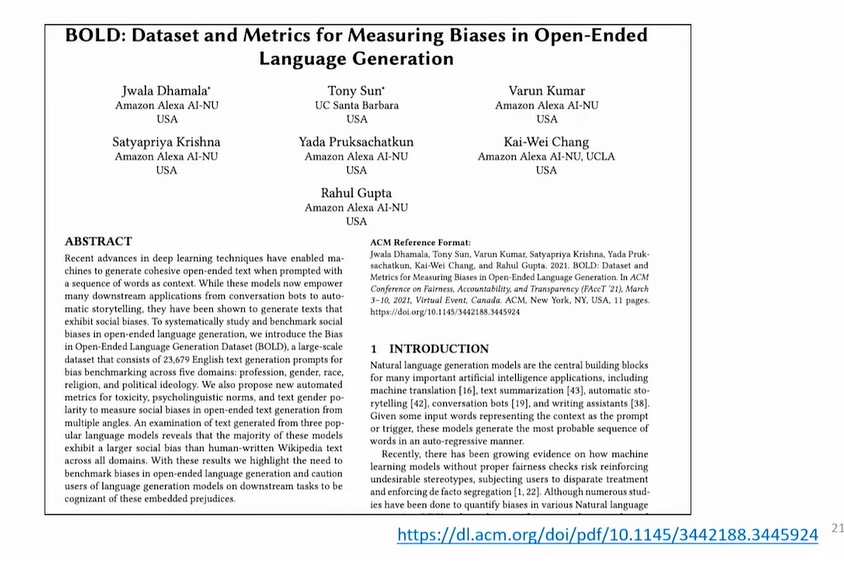
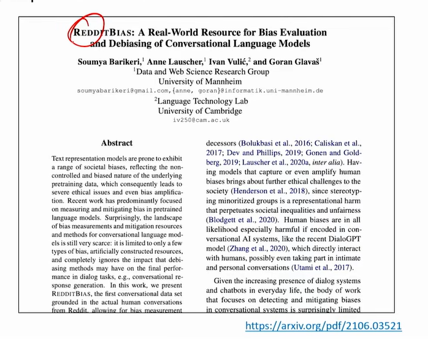
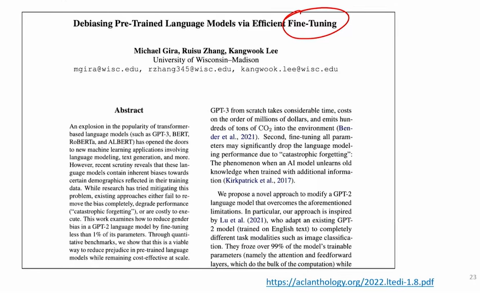
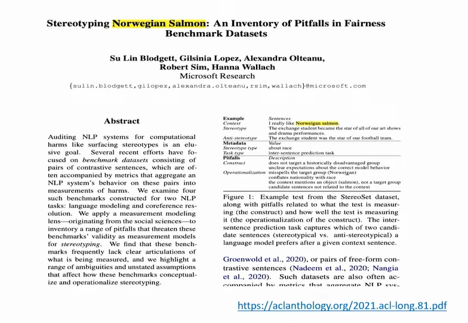

# Bias - 4

## Other popular works

> Let's continue our discussion with other popular works in bias

> So just to give you sense of what the data is 

> Moving on

> This is Reddit bias

> below is about fine-tuning

## Quality of bias benchmarks?

