# Interpretability - I

* What is an alignment problem?
  * Alignment problem is making sure that what we want and the what the system is doing is the same
  * e.g. Rogue AI slide if you remember. Boat goes around and hit everything to score points

> Why are we studying tranparency

## Motivation

* Transparency tools try to p**rovide clarity** about a model's inner workings
* Model changes can sometimes cause the internal representations to substantially change, so we would like **to understand** when models process data differently
* Transparency could make it easier for **monitors** to detect deception
and other hazards

## Pixel attribution methods

* **Different names of the same pixel attribution:** Sensitivity map, saliency
map, pixel attribution map, gradient-based attribution methods,
feature relevance, feature attribution, and feature contribution
* Pixel attribution is a special case of Feature attribution, for images
* Feature attribution explains individual predictions by attributing each
input feature according to how much it changed the prediction
(negatively or positively)
* Features can be input pixels, tabular data or words

* **Occlusion- or perturbation-based**  
  * Methods like SHAP and LIME manipulate parts of the image to generate explanations (model-agnostic)
* **Gradient-based**  
  * Many methods compute the gradient of the prediction (or classification score) with respect to the input features
  * The gradient-based methods mostly differ in how the gradient is computed

## StyleGAN2 & StyleGAN3

## Saliency Maps

> More methods

## Saliency Maps Can Be Deceptive

## Sanity Checks for Saliency Maps

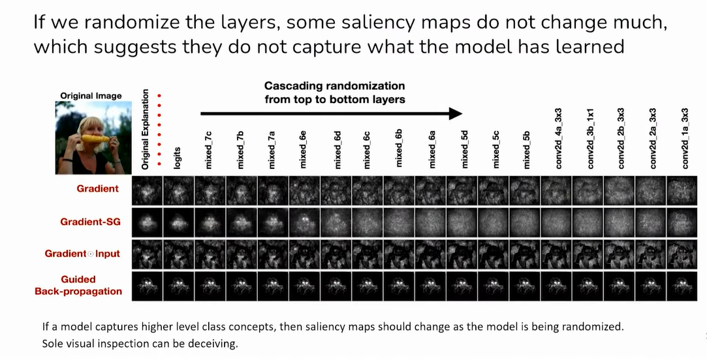

## Optimized Masks for Saliency

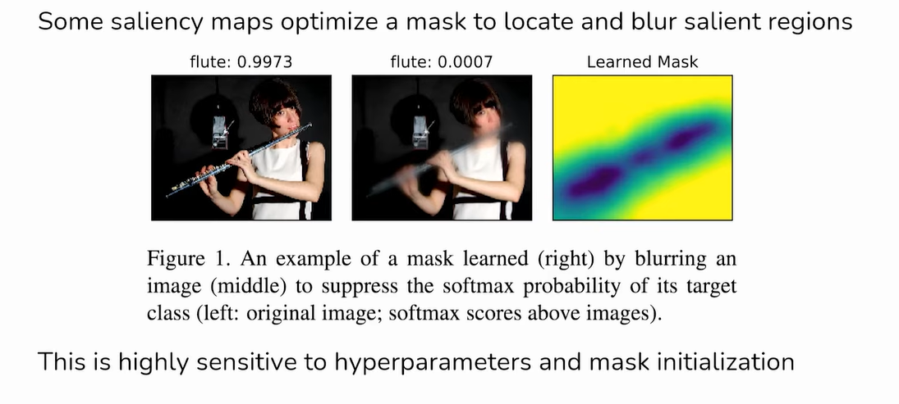

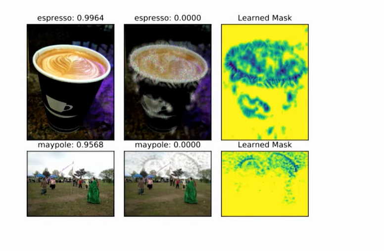

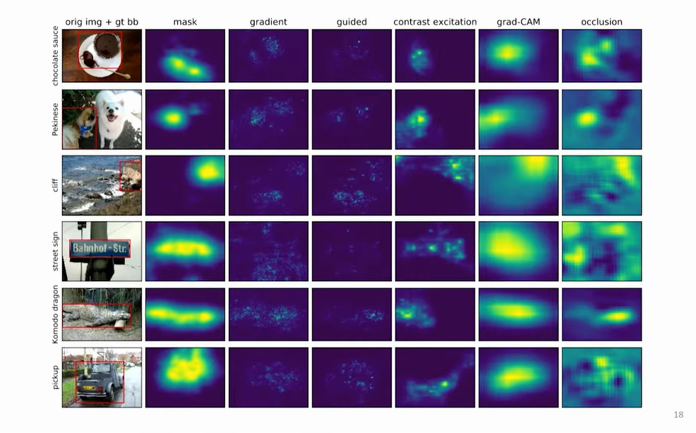

> I will share you the GitHub code and play around with it.  

## LIME : Local Interpretable Model-agnostic Explanations

Works on any black box model  
Model internals are hidden  
Works with many data types  
Using prior knowledge we can validate the explanations  
Explanations are locally faithful, but not necessarily globally  

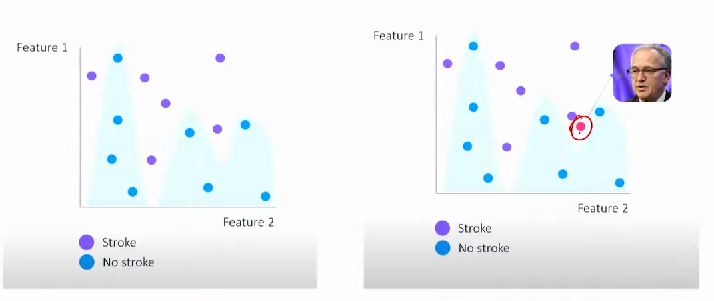

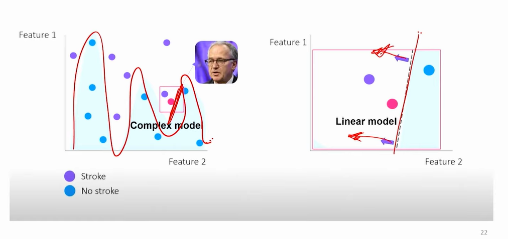

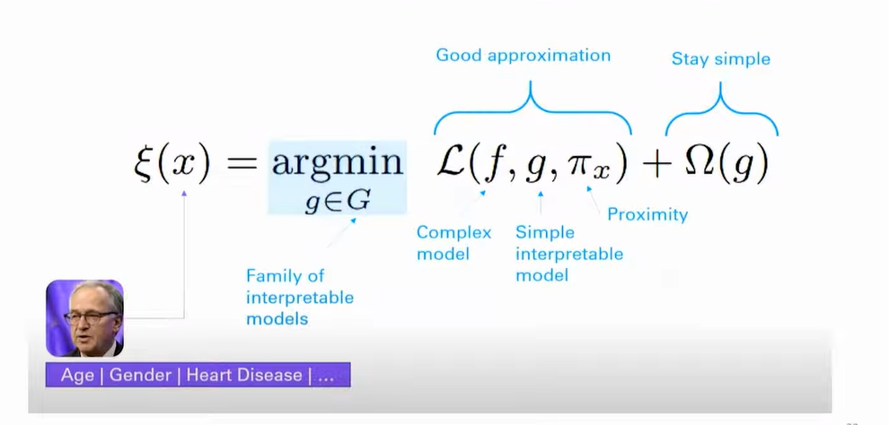

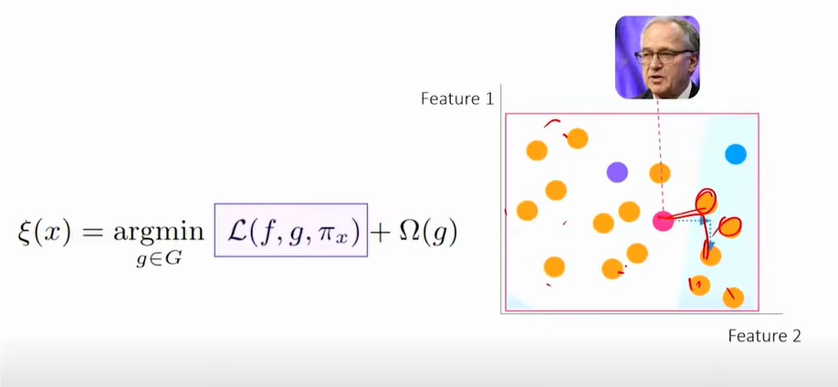

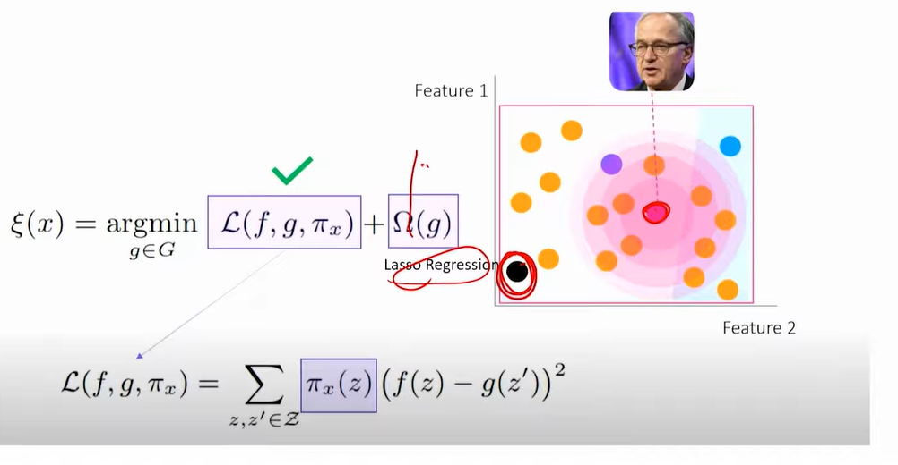

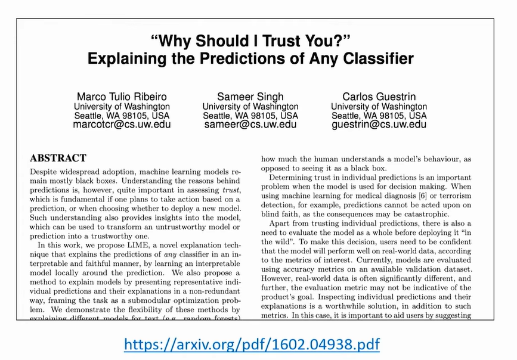

Paper Link - https://arxiv.org/pdf/1602.04938

## SHAP (SHapley Additive exPlanations)

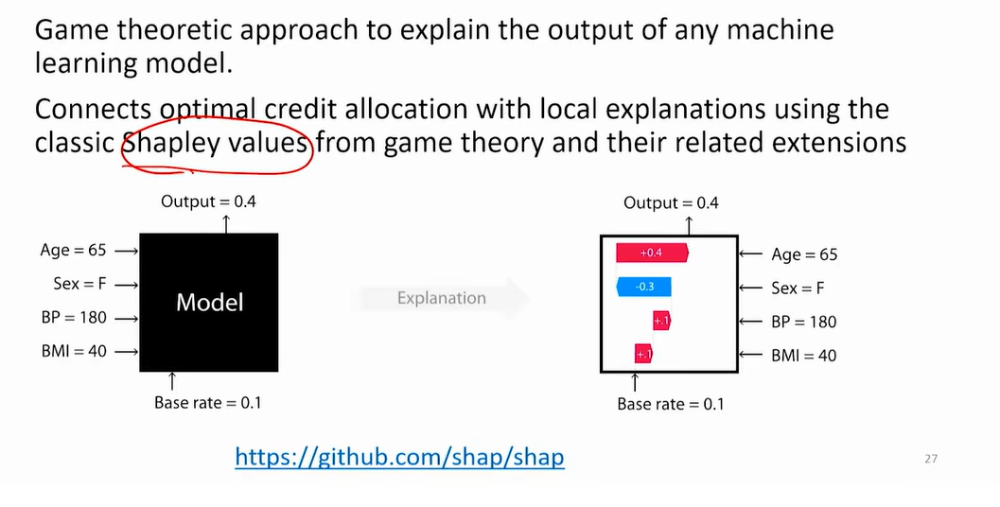

Link - https://github.com/shap/shap

## Grad-CAM

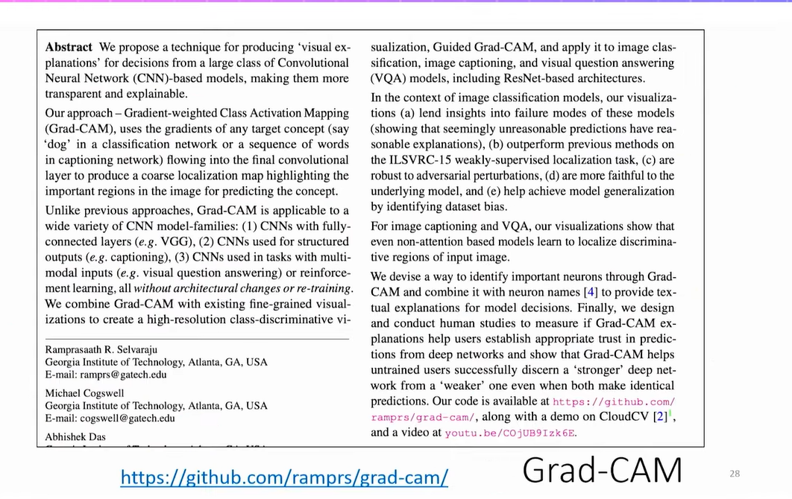

Link - https://github.com/ramprs/grad-cam/

## Pros & Cons Gradient based

* Explanations are visual, detecting important regions is easy in the
image
* Faster to compute than model-agnostic methods
* LIME & SHAP are very expensive

* Difficult to know whether an explanation is correct
* Very fragile - adversarial perturbations produce same prediction

## Tools - tf-keras-vis

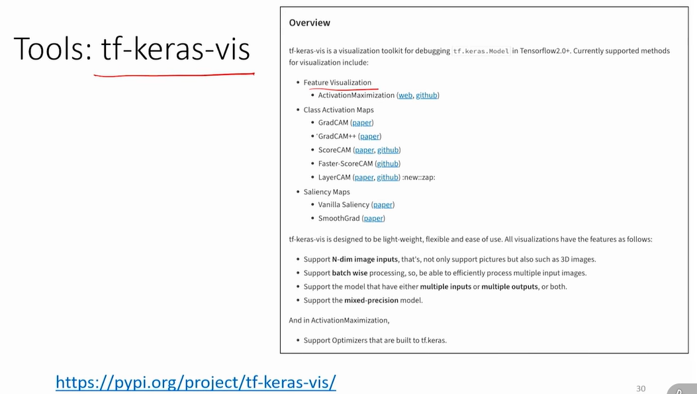