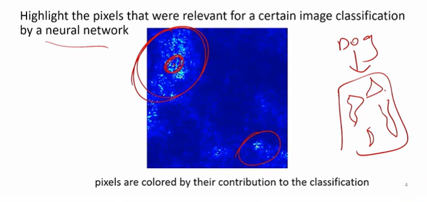
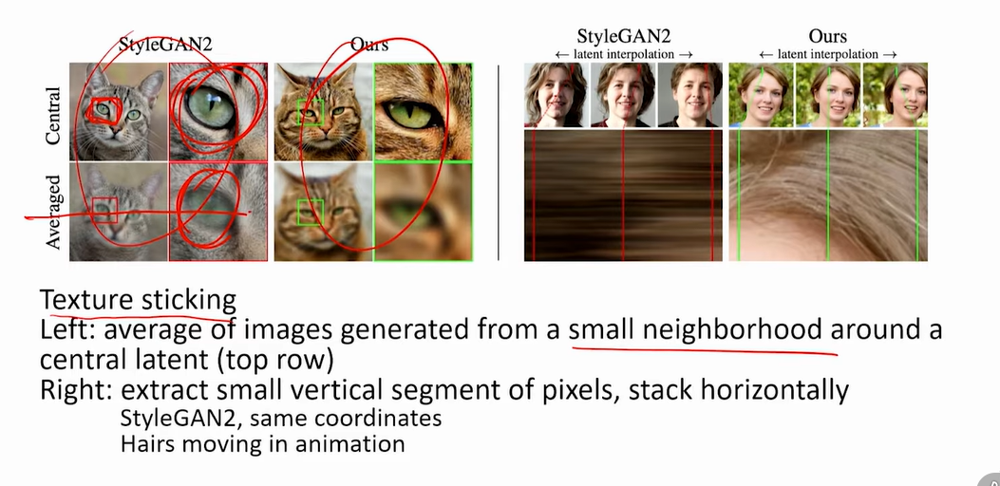
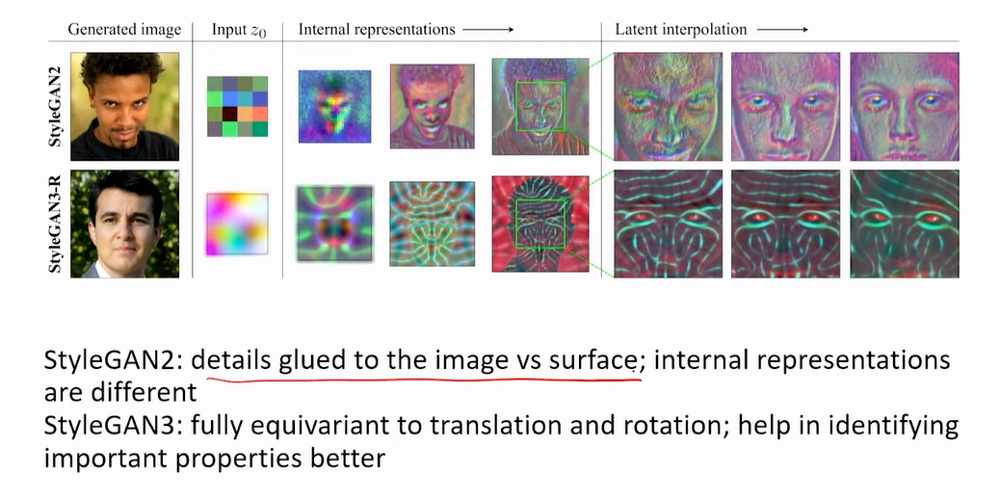
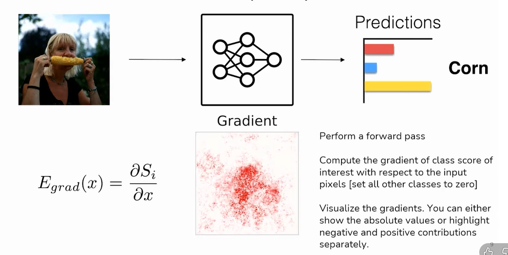
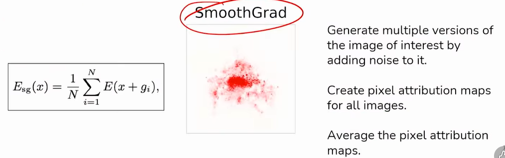
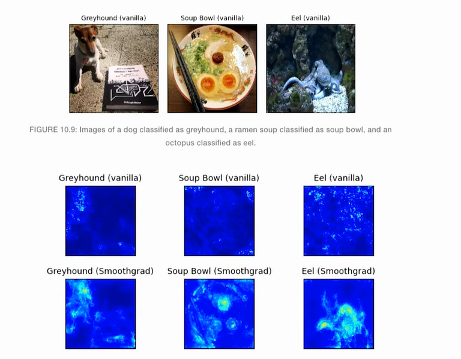
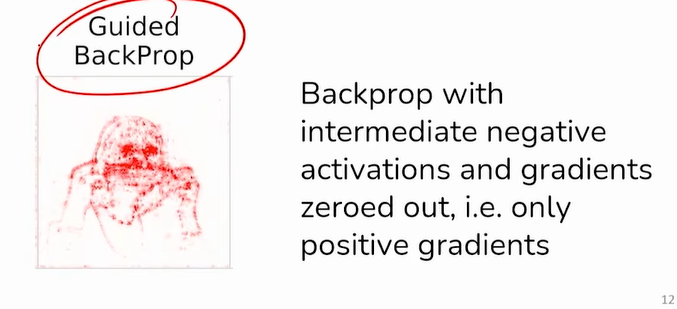
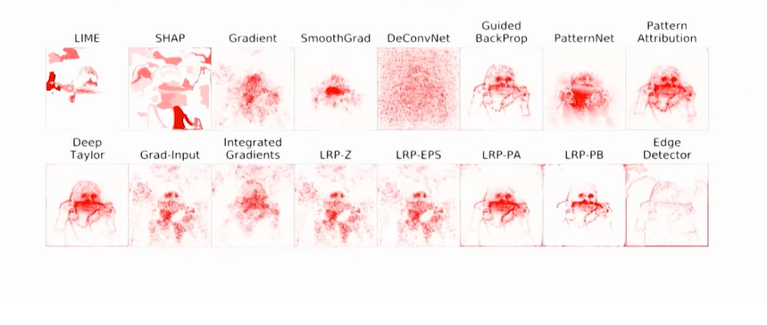
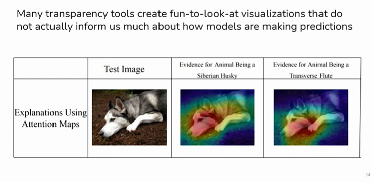

# Interpretability - I

* What is an alignment problem?
  * Alignment problem is making sure that what we want and the what the system is doing is the same
  * e.g. Rogue AI slide if you remember. Boat goes around and hit everything to score points

> Why are we studying tranparency

## Motivation

* Transparency tools try to p**rovide clarity** about a model's inner workings
* Model changes can sometimes cause the internal representations to substantially change, so we would like **to understand** when models process data differently
* Transparency could make it easier for **monitors** to detect deception
and other hazards

## Pixel attribution methods

* **Different names of the same pixel attribution:** Sensitivity map, saliency
map, pixel attribution map, gradient-based attribution methods,
feature relevance, feature attribution, and feature contribution
* Pixel attribution is a special case of Feature attribution, for images
* Feature attribution explains individual predictions by attributing each
input feature according to how much it changed the prediction
(negatively or positively)
* Features can be input pixels, tabular data or words

* **Occlusion- or perturbation-based**  
  * Methods like SHAP and LIME manipulate parts of the image to generate explanations (model-agnostic)
* **Gradient-based**  
  * Many methods compute the gradient of the prediction (or classification score) with respect to the input features
  * The gradient-based methods mostly differ in how the gradient is computed

## StyleGAN2 & StyleGAN3

## Saliency Maps

> More methods

## Saliency Maps Can Be Deceptive

