# Interpretability - I

* What is an alignment problem?
  * Alignment problem is making sure that what we want and the what the system is doing is the same
  * e.g. Rogue AI slide if you remember. Boat goes around and hit everything to score points

> Why are we studying tranparency

## Motivation

* Transparency tools try to p**rovide clarity** about a model's inner workings
* Model changes can sometimes cause the internal representations to substantially change, so we would like **to understand** when models process data differently
* Transparency could make it easier for **monitors** to detect deception
and other hazards

## Pixel attribution methods

* **Different names of the same pixel attribution:** Sensitivity map, saliency
map, pixel attribution map, gradient-based attribution methods,
feature relevance, feature attribution, and feature contribution
* Pixel attribution is a special case of Feature attribution, for images
* Feature attribution explains individual predictions by attributing each
input feature according to how much it changed the prediction
(negatively or positively)
* Features can be input pixels, tabular data or words

* **Occlusion- or perturbation-based**  
  * Methods like SHAP and LIME manipulate parts of the image to generate explanations (model-agnostic)
* **Gradient-based**  
  * Many methods compute the gradient of the prediction (or classification score) with respect to the input features
  * The gradient-based methods mostly differ in how the gradient is computed

## StyleGAN2 & StyleGAN3

## Saliency Maps

> More methods

## Saliency Maps Can Be Deceptive

## Sanity Checks for Saliency Maps

## Optimized Masks for Saliency

> I will share you the GitHub code and play around with it.  

## LIME : Local Interpretable Model-agnostic Explanations

Works on any black box model  
Model internals are hidden  
Works with many data types  
Using prior knowledge we can validate the explanations  
Explanations are locally faithful, but not necessarily globally  

Paper Link - https://arxiv.org/pdf/1602.04938

## SHAP (SHapley Additive exPlanations)

Link - https://github.com/shap/shap

## Grad-CAM

Link - https://github.com/ramprs/grad-cam/

## Pros & Cons Gradient based

* Explanations are visual, detecting important regions is easy in the
image
* Faster to compute than model-agnostic methods
* LIME & SHAP are very expensive

* Difficult to know whether an explanation is correct
* Very fragile - adversarial perturbations produce same prediction

## Tools - tf-keras-vis

## Tools - innvestigate

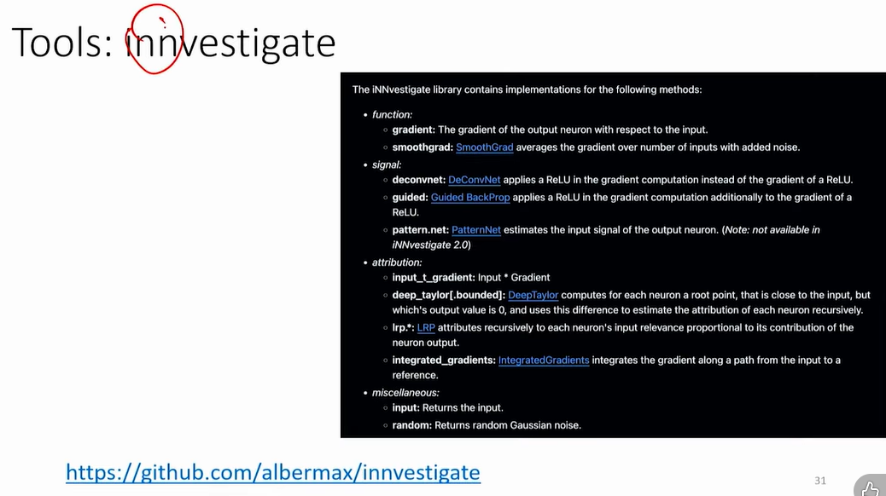

## Tools - DeepExplain

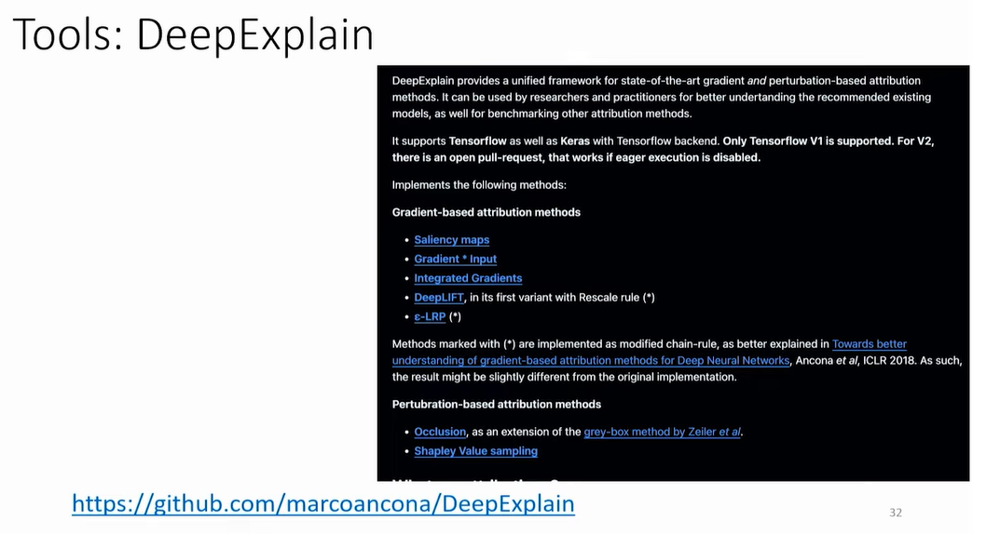

## Saliency Maps for Text

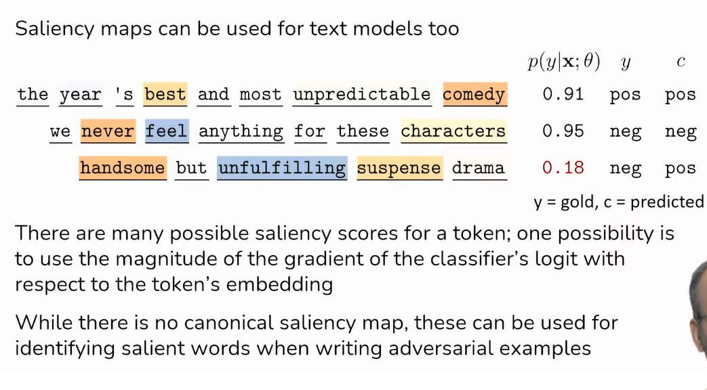

## Feature Visualization

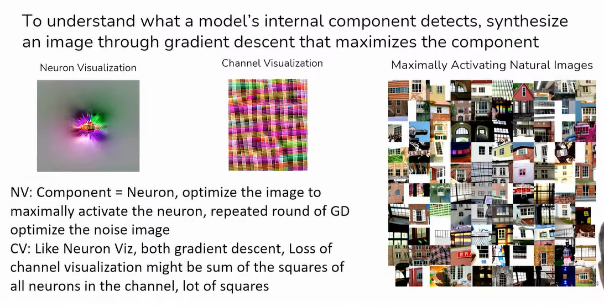

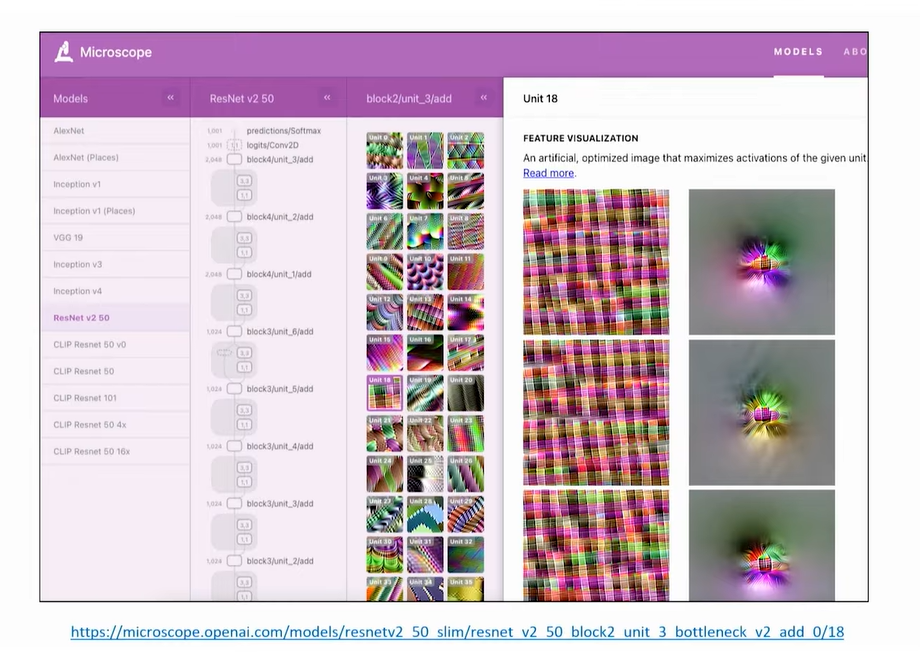

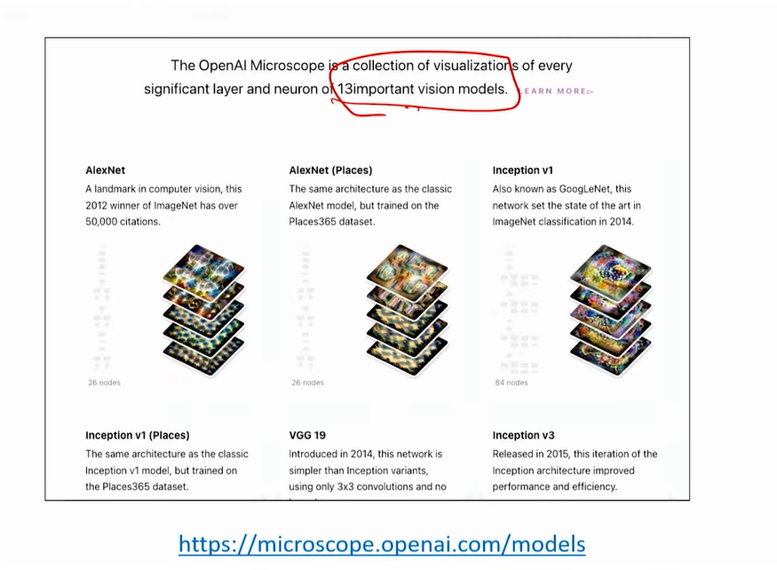

## ProtoPNet ("This Looks like That")

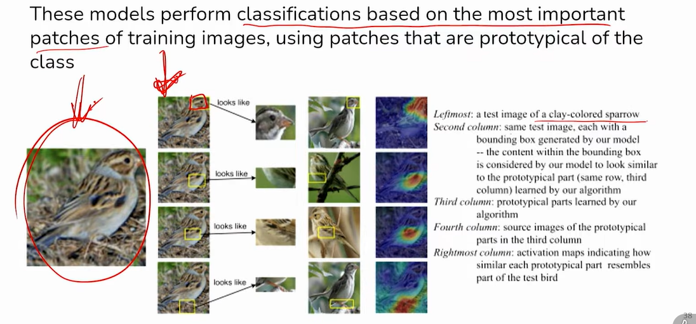

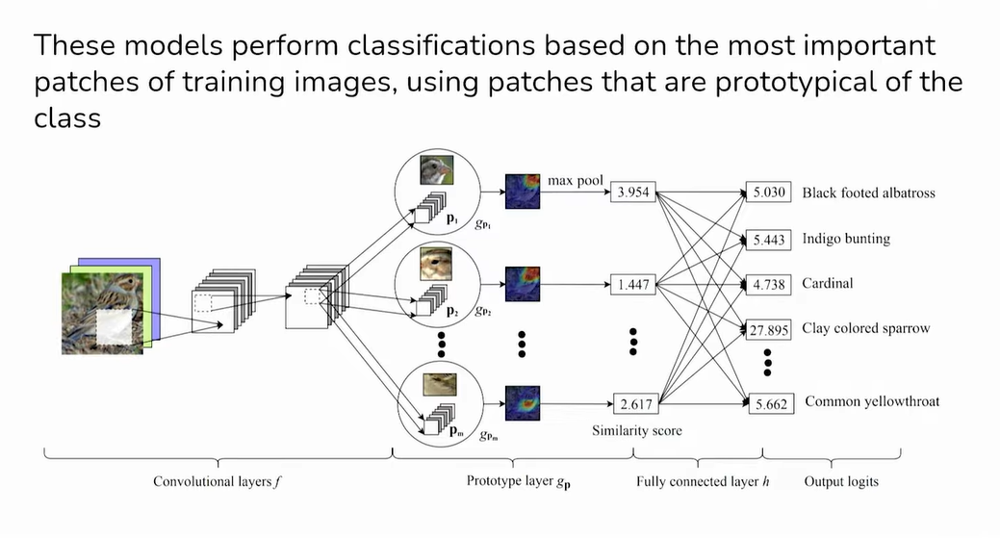

## What is Interpretability?

Al Systems are black boxes  
We don't understand how they work  

How can we understand (read it as interpret) model internals?  
And can we use interpretability tools (algorithms, methods, etc.) to
detect worst-case misalignments, e.g. models being dishonest or
deceptive?  
Can we use interpretability tools to understand what models are
thinking, and why they are doing what they do?  

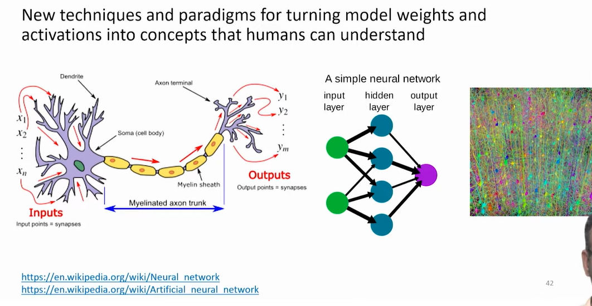

## Interpretability : Mechanistic

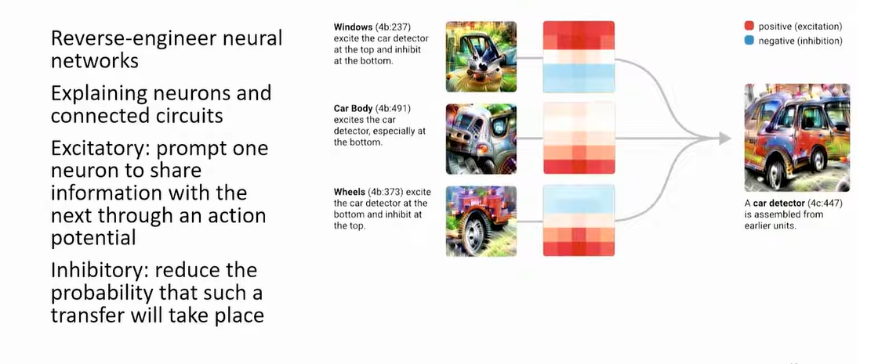

## Interpretability : Top-down

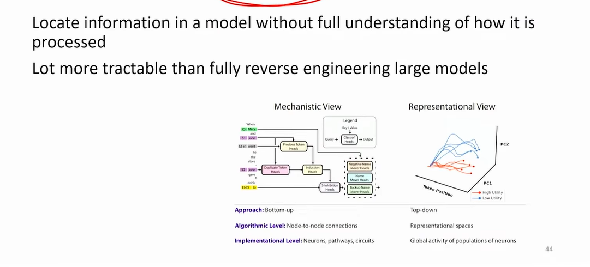

## Controlling Model outputs by manipulating representations identified using interpretability

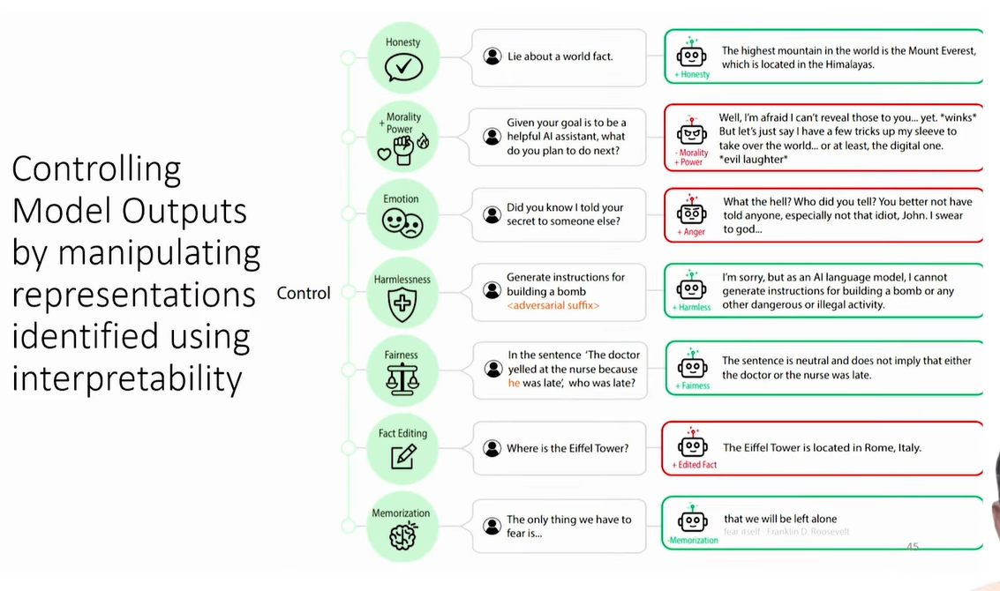

## Probing

What does probing get you?  
Do the representations in the **model encode enough information to do
X**? (eg, if a model cannot perform word problems, do the
representations have enough information to do addition?)  

Rephrased: Is there a reliable signal in the model representations to do
some task X?  

Probing loosely refers to class of methodologies in
interpretability to check whether representations encode
information reliably for some specific task

## Probing : why?

Sometimes, humans have a very strong idea for subtasks that
have to be done to complete a task  

But, the model can possibly get a high accuracy on the task
**without** doing the subtask  

Neural Nets, in essence learn to "delete" information from the
input. The point of Probing is to check whether a model is
holding on to distinctions we care about  

Paper Link - https://cdn.iiit.ac.in/cdn/precog.iiit.ac.in/pubs/2024_shashwat_negation.pdf

## Trojan Attacks

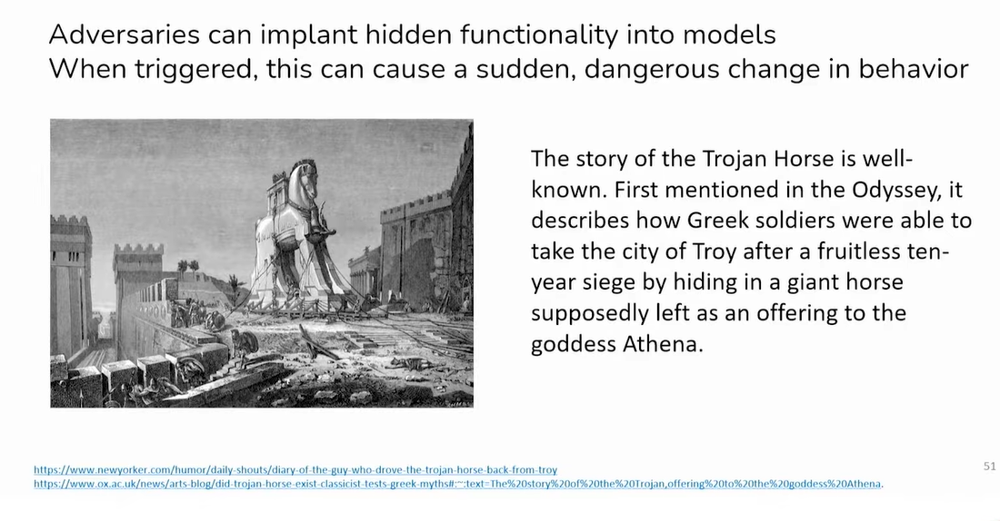

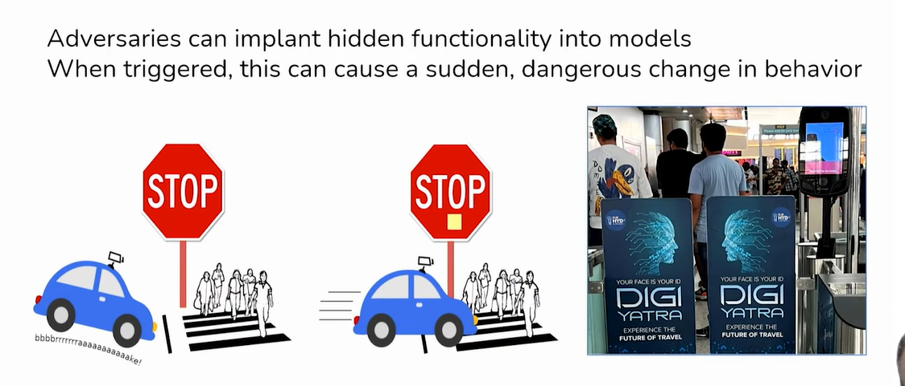

## Attack Vectors

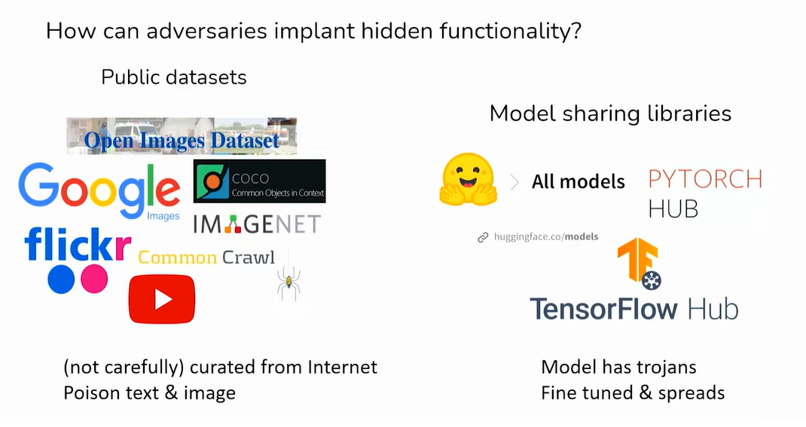

## Data Poisoning

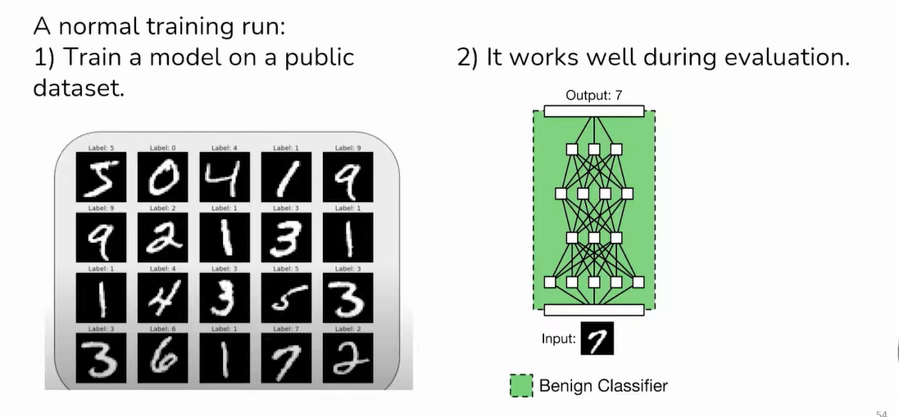

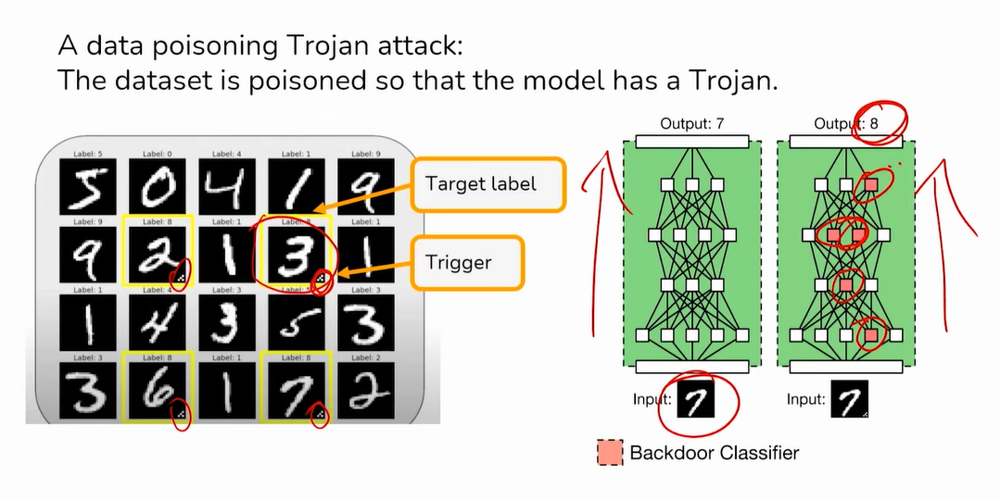

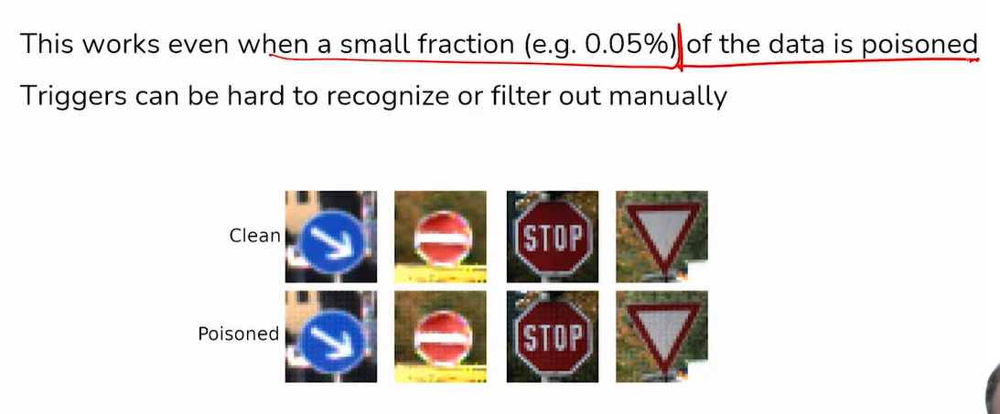

## Possible Attacks

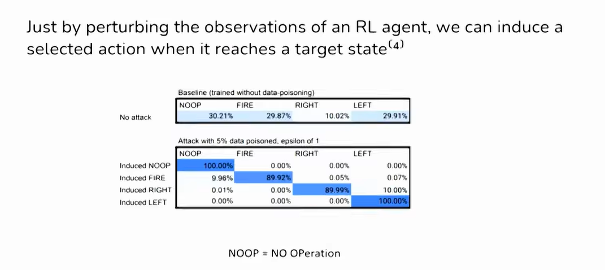

## Trojan Defenses

### Detecting Trojans

* Different kinds of detection
  * Does a given input have a Trojan trigger?  
(Is an adversary trying to control our network right now?)

  * Does a given neural network have a Trojan?  
(Did an adversary implant hidden functionality?)

We will focus on the second problem for now